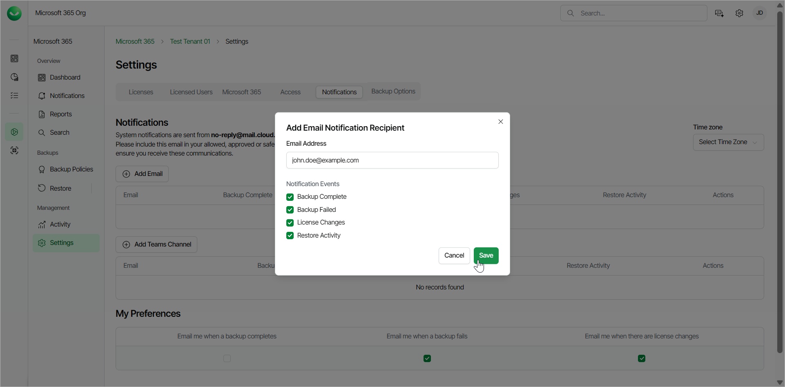
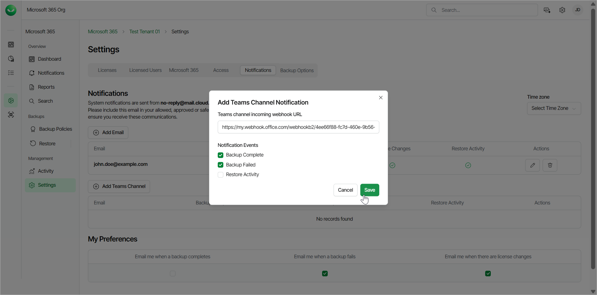

# Managing Notifications

Veeam Data Cloud for Microsoft 365 allows you to configure email recipients for Veeam Data Cloud for Microsoft 365 system notifications and add Microsoft Teams channels where you can receive Veeam Data Cloud for Microsoft 365 system notifications.

|  |
| --- |
| note |
| Veeam Data Cloud for Microsoft 365 email notifications are sent from the no-reply@mail.cloud.veeam.com email address. To ensure you receive all communications from Veeam Data Cloud for Microsoft 365, you must include no-reply@mail.cloud.veeam.com in your allowed, approved or safe senders list in your email client. |

|  |
| --- |
| tip |
| You can select a time zone in the Time zone drop-down list. This setting affects the time shown in the email notifications that your tenant receives from Veeam Data Cloud for Microsoft 365. By default, Veeam Data Cloud for Microsoft 365 uses the UTC time zone. |

Email Recipients

To configure email recipients for system notifications, do the following:

1. On the Microsoft 365 page, click the name of the tenant you want to manage.
2. Select Settings.
3. Go to the Notifications tab.
4. In the Notifications section, click Add Email.
5. In the Add Email Notification Recipient window, do the following:

1. In the Email Address field, add the email address of the user you want to receive notifications.
2. In the Notification Events section, select the check boxes for the notifications you want the user to receive. The available notifications are the following:

* Backup Complete. Receive hourly notifications about the backup status.
* Backup Failed. Receive hourly notifications about the backup status. If you select the Backup Complete check box, the Backup Failed check box is selected as well.
* License Changes. Receive notifications when there are changes in the total number of licensed users whose data is protected.
* Restore Activity. Receive notifications about restore process activities.

1. Click Save.

Teams Channel Notifications

To configure Microsoft Teams channel notifications, do the following:

1. Create an incoming webhook in Teams. To do that, follow the instructions in [this Microsoft article](https://learn.microsoft.com/en-us/microsoftteams/platform/webhooks-and-connectors/how-to/add-incoming-webhook?tabs=newteams%2Cdotnet#create-an-incoming-webhook). You must copy and save the unique webhook URL that is generated in the end of the process, because you need it for the configuration in Veeam Data Cloud for Microsoft 365.
2. In Veeam Data Cloud for Microsoft 365, on the Microsoft 365 page, click the name of the tenant you want to manage.
3. Select Settings.
4. Go to the Notifications tab.
5. In the Notifications section, click Add Teams Channel.
6. In the Add Teams Channel Notification window, do the following:

1. In the Teams channel incoming webhook URL field, add the webhook URL that you copied from Teams in Step 1.
2. In the Notification Events section, select the check boxes for the notifications you want to receive in your Teams channel. The available notifications are the following:

* Backup Complete. Receive notifications when the backup process is completed.
* Backup Failed. Receive notifications when the backup process has failed. If you select the Backup Complete check box, the Backup Failed check box is selected as well.
* Restore Activity. Receive notifications about restore process activities.

1. Click Save.

Page updated 2026-07-21
