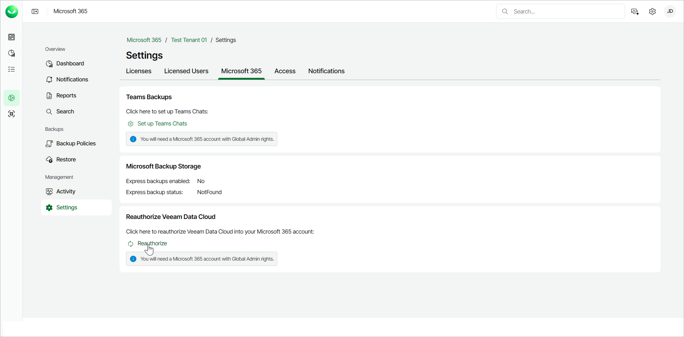
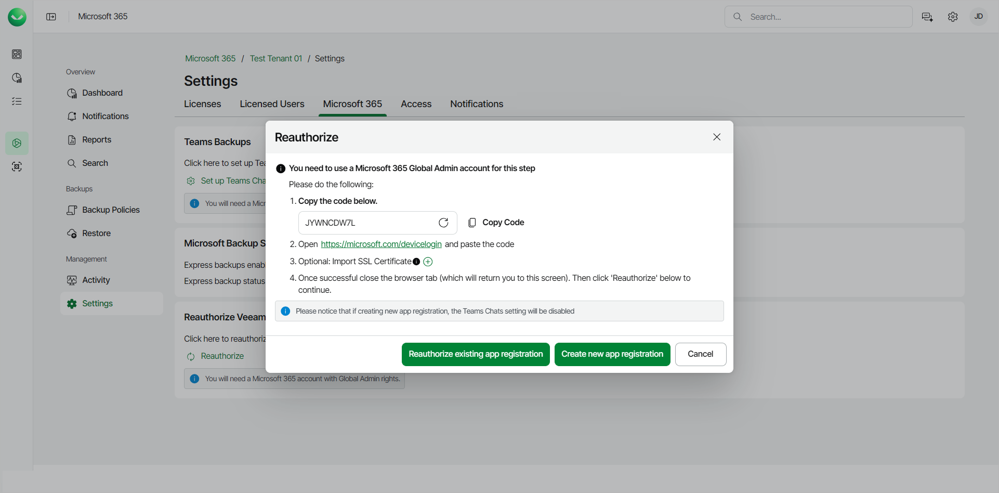

# Reauthorizing Veeam Data Cloud for Microsoft 365

You may need to reauthorize Veeam Data Cloud access to your Microsoft 365 tenant. This may be required in the following cases:

* If you have accidentally removed authorization for Veeam Data Cloud to access your Microsoft 365 data.
* If you see the following error message in the backup session logs: The identity of the calling application could not be established.

To reauthorize Veeam Data Cloud, do the following:

1. On the Microsoft 365 page, click the name of the tenant you want to manage.
2. Select Settings.
3. Select the Microsoft 365 tab.
4. In the Reauthorize Veeam Data Cloud section, click Reauthorize.

If you have a multi-tenant app registration, click Reauthorize the customer on the multi tenant app registration.

1. In the Reauthorize window, copy the generated code to connect to your Microsoft tenancy.

|  |
| --- |
| Note |
| To perform this step successfully, you must use the Microsoft 365 Global Admin account. |

1. Click the <https://microsoft.com/devicelogin> link, paste the code you copied, and click Next.
2. Select the Microsoft account under which you want to authenticate against Microsoft 365. The account must have the Microsoft 365 Global Admin permissions.
3. Click Continue and close the window.
4. In Veeam Data Cloud for Microsoft 365, select one of the following options:

* Click Reauthorize existing app registration to reauthorize and continue using your existing application registration.
* Click Create new app registration, to create a new application registration.

|  |
| --- |
| NOTE |
| If you select to create a new app registration, you must enable team chats backup again. For more information, see [Enabling Microsoft Team Chats Backup](m365_enable_team_chats_backup.md). |

