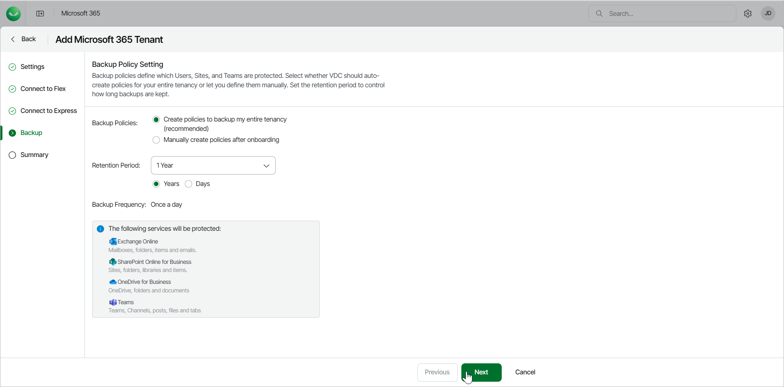

# Step 5. Configure Backup Policy

At the Backup step of the wizard, select whether Veeam Data Cloud for Microsoft 365 should automatically configure backup policies or let you manually create the policies after onboarding.

|  |
| --- |
| Note |
| Before you select whether Veeam Data Cloud automatically configures backup policies or you manually create the policies after onboarding, make sure you have secured the following:   * The customer is familiar with the Veeam Data Cloud services licensing model. * You have discussed with your customer which tenant users and services, for example, Teams or SharePoint, should be protected with Veeam Data Cloud, and you have reached an agreement on the resources to be included in the backup.   You can adjust your backup policy later, but be aware that the change will be reflected in your usage report with a delay due to the following reasons:   * Veeam Data Cloud applies 31 day usage retention for users removed from backup policy. For details, see [Licensing](m365_licensing.md#consumption). * The reported monthly usage is based on the highest level of daily consumption of licensed units recorded during the current month. For details, see [Viewing Subscriptions](sp_subscriptions_view.md). |

To select how to configure backup policies:

1. In Backup Policies, select one of the following options:

1. Create policies to back up my entire tenancy. This option is recommended and enables automatic backup policies for all users, sites and teams.

* Retention Period. Set the number of Years or Days for the retention period of your backups.

1. Manually create policies after onboarding. This option allows you to manually set your backup policies after onboarding.

1. Click Next.

