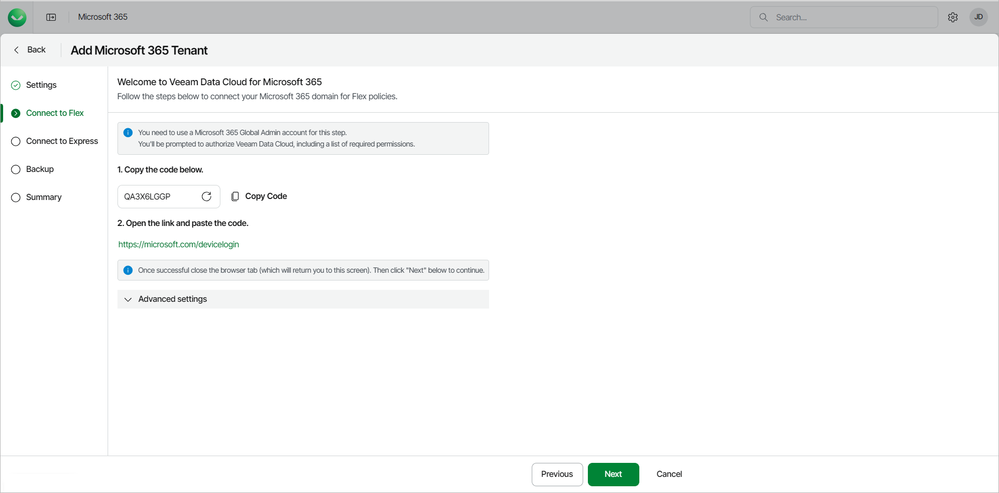
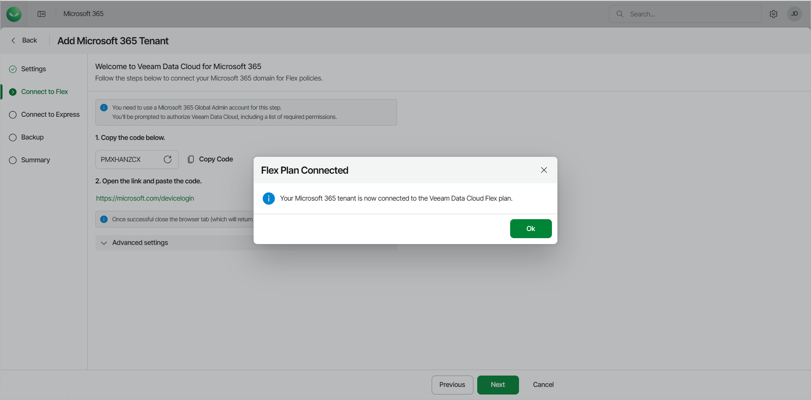
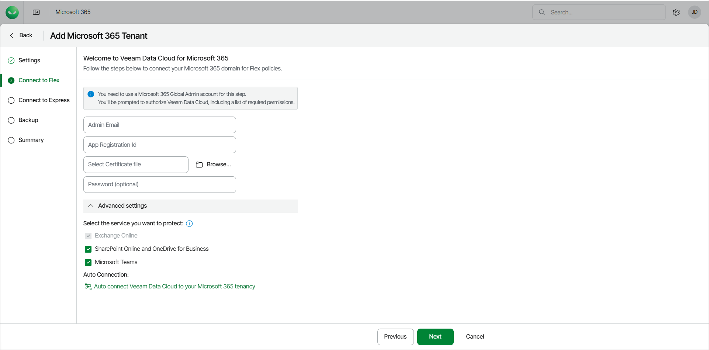

# Step 3. Connect to Flex

At the Connect to Flex step of the wizard (or Connection step if you only have a Foundation or Advanced plan), connect Veeam Data Cloud to the Microsoft 365 tenant of your customer.

Automatic Connection Steps

|  |
| --- |
| note |
| To perform the steps successfully, you must use a Microsoft 365 Global Admin account. |

If you choose to automatically connect Veeam Data Cloud to the Microsoft 365 tenant of your customer (recommended), do the following:

1. Copy the generated code. To keep the process secure, you may need to share the device code with the customer and ask them to sign in to the Microsoft Identity platform as described in steps 2, 3 and 4.
2. Click the <https://microsoft.com/devicelogin> link and paste or enter the code that you copied.

1. Select the Microsoft account under which you want to authenticate against Microsoft 365. The account must have the Microsoft 365 Global Admin permissions.
2. Click Continue and close the window.
3. Return to Veeam Data Cloud. Once the connection is established, in the Flex Plan Connected window, click Ok.

1. [Optional] In the Advanced settings section, select services that you want to back up.

Make sure to select only the services that are available in the Microsoft 365 tenant that you are connecting to.

1. Click Next.

Manual Connection Steps

If you choose to manually connect Veeam Data Cloud to the Microsoft 365 tenant of your customer, do the following:

1. In Microsoft Entra ID, do the following:

1. Create a new App Registration.
2. Assign the [required permissions](m365_permissions.md) to the new application registration.
3. Create and assign a certificate to the application.

X.509 compatible certificates from a trusted CA (Certificate Authority) and self-signed certificates are supported. For more information, see [this Microsoft article](https://learn.microsoft.com/en-us/entra/identity-platform/how-to-add-credentials?tabs=certificate).

1. Export the certificate to a PFX file. You will use this file at step 4-c of this procedure.
2. On the overview page of the application, copy the Application (client) ID value.

1. In Veeam Data Cloud for Microsoft 365, in the Advanced settings section, click Manually connect Veeam Data Cloud to your Microsoft 365 tenancy.

1. In the pop-up window, click I understand.
2. Do the following:

1. In the Admin Email field, type the email address of a Microsoft 365 user account that belongs to your Microsoft 365 tenant.
2. In the App Registration id field, type the Application (client) ID value that you copied during the application registration in Microsoft Entra ID.
3. In the Select Certificate file field, click Browse and select the PFX certificate file that you exported from Microsoft Entra ID.
4. In the Password field, only type the password if you have exported the certificate with password protection enabled.
5. [Optional] In the Advanced settings section, select services that you want to back up.

Make sure to select only the services that are available in the Microsoft 365 tenant that you are connecting to.

1. Click Next.

|  |
| --- |
| tip |
| To ensure the manual connection is successful, confirm the following:   * You created an application registration in your Microsoft Entra ID and not an Enterprise application. * The manually created app registration is within the correct tenant ID. For more information, see [this Microsoft article](https://learn.microsoft.com/en-us/sharepoint/find-your-office-365-tenant-id). * You assigned all the required permissions to the application registration and ensured that all required permissions are consented to. For more information, see [this Microsoft article](https://learn.microsoft.com/en-us/entra/identity-platform/application-consent-experience). |

