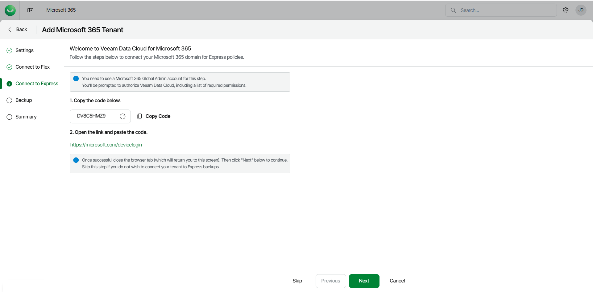

# Step 4. Connect to Express

The Connect to Express step of the wizard is available only if your customer has a subscription to the Express or Premium license plan. Note that subscriptions with the Express or Premium Veeam Data Cloud for Microsoft 365 plan are not available for service providers and their customers at the moment. For more information, see [Plans](m365_licensing.md#plans) and [Requesting Subscriptions](sp_subscriptions_request.md).

To connect Microsoft 365 Backup Storage to Veeam Data Cloud for Microsoft 365, do the following:

|  |
| --- |
| note |
| To perform the steps successfully, you must use a Microsoft 365 Global Admin account. |

1. Copy the generated code. To keep the process secure, you may need to share the device code with the customer and ask them to sign in to the Microsoft Identity platform as described in steps 2, 3 and 4.
2. Click the <https://microsoft.com/devicelogin> link and paste or enter the code that you copied.
3. Select the Microsoft account under which you want to authenticate against Microsoft 365. The account must have the Microsoft 365 Global Admin permissions.
4. Click Continue and close the window.
5. Return to Veeam Data Cloud. Once the connection is established, in the Express Plan Connected window, click Ok.
6. Click Next.

|  |
| --- |
| TIP |
| You can click Skip to skip this step if you do not want to connect the tenant to Express backups. |

