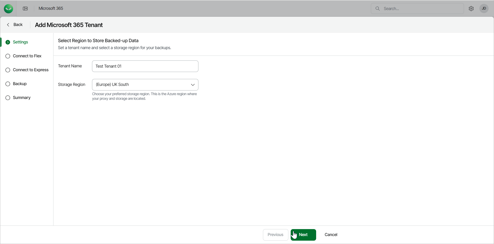

# Step 2. Specify Tenant Settings

At the Settings step of the wizard, specify the tenant name and select a storage region for backups of your customer data.

1. In the Tenant Name field, specify a name for the new tenant.
2. From the Storage Region drop-down list, select a Microsoft Azure region where the backup infrastructure and storage will be provisioned.

For information on supported Microsoft Azure regions, see [Backup Storage Regions](m365_region_availability.md).

1. Click Next.

