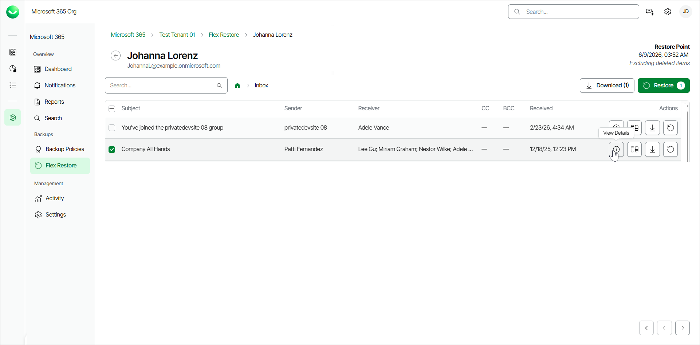
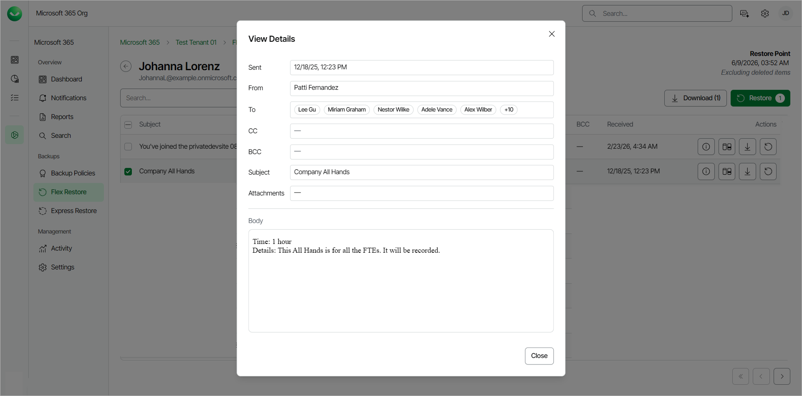

# Viewing Outlook Emails

To view a single email within a specific folder of a mailbox:

1. On the Microsoft 365 page, click the name of the tenant you want to manage.
2. Select Flex Restore.
3. By default, Veeam Data Cloud uses the latest available restore point for data restore. If you want to select another restore point, click on the  Restore Point information box. On the calendar, select the date and time when the necessary restore point was created and click Apply.
4. Click the name of the mailbox that contains the email you want to view.
5. Click on the folder that contains the email you want to view.
6. Select the email you want to view and, in the Actions column, click View Details.

1. The email contents will open in the View Details window. Veeam Data Cloud displays the following information:

* Sent — date and time when the email was sent.
* From — sender of the email.
* To — receiver of the email.
* CC — contacts to whom a copy of the email was sent.
* BCC — contacts to whom a blind copy of the email was sent.
* Subject — subject of the email.
* Attachments — files attached to the email.
* Body — the body of the email.

