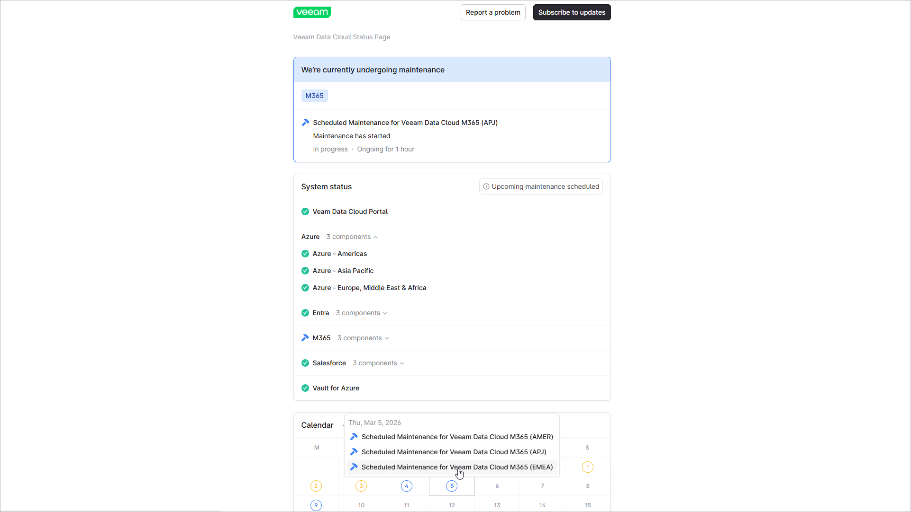

# Veeam Data Cloud Maintenance

Maintenance in Veeam Data Cloud involves tasks that help keep the services secure, up to date, and reliable. During the maintenance time, operations in the affected region (for example, backups, restores, adding tenants, or policy changes) may be temporarily unavailable. Depending on the type of maintenance task, a short downtime may be expected.

Maintenance activities are scheduled and performed independently for each Veeam Data Cloud workload and the schedule may be adapted to the time zones of the selected Microsoft Azure regions. To help you track scheduled maintenance, Veeam Data Cloud notifies you on upcoming maintenance by email. For Microsoft Entra ID and Salesforce workloads, a plan of upcoming maintenance is available on their workload page. For details, see [Viewing Salesforce Tenants](sf_tenant_view.md) and [Viewing Microsoft Entra ID Tenants](entra_id_tenant_view.md).

To view a complete plan for upcoming maintenance and the status of Veeam Data Cloud services for all workloads, use the Veeam Data Cloud Status page outside the Veeam Data Cloud portal.

Viewing Veeam Data Cloud Status

You can view the status of Veeam Data Cloud services and the plan for upcoming maintenance on [the Veeam Data Cloud Status page](https://vdcstatus.veeam.com/).

The System status section displays information on the availability of the Veeam Data Cloud portal and protection services for all workloads in the AMER, APJ and EMEA global regions.

Each service or component can have one of the following statuses:

Viewing Veeam Data Cloud Status

| Status | Description |
| Operational | The monitoring system currently does not record any issues affecting the Veeam Data Cloud platform. If you are experiencing an issue with Veeam Data Cloud, click Report a problem and submit a support ticket. |
| Under maintenance | Scheduled maintenance activities are performed to improve Veeam Data Cloud. Some services may be temporarily unavailable during this time. |
| Performance degradation | You may notice minor performance issues and increased latency. Core services (for example, backups, restores, adding tenants, or policy changes) remain available. |
| Partial outage | One or more core services are disrupted and unavailable to some customers or in a specific region. |
| Full outage | One or more core services have failed and are unavailable in one or more regions. |

|  |
| --- |
| Tip |
| Click Subscribe to updates to set up email, RSS, or Slack notifications for upcoming or existing incidents. |

The Calendar section shows the history of changes in Veeam Data Cloud status and the history and schedule of Veeam Data Cloud maintenance.

To display details of a specific event, hover the cursor over a required day in the calendar and select the event.

