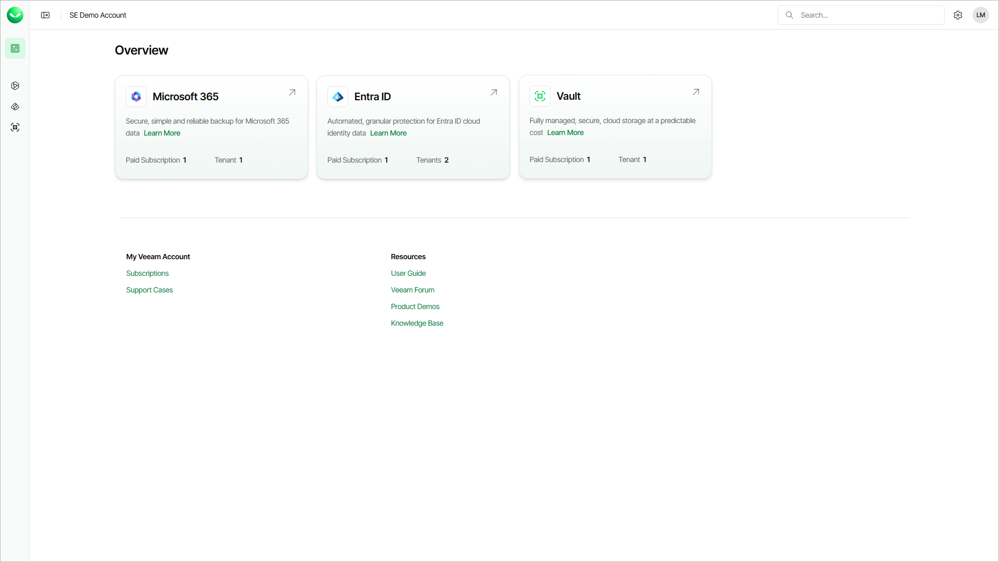

# Organization Overview

A Veeam Data Cloud organization incorporates your Veeam Data Cloud accounts and one or more subscriptions for the workloads your customers want to protect.

On the Overview page, you can find information about the protected workloads in the Veeam Data Cloud organizations of your customers. To protect additional workloads, request a subscription for them. You can also request a subscription for Veeam Data Cloud Vault to integrate storage vaults with other Veeam solutions. To request a subscription, select Purchase next to the product you want to add.

On the Overview page, the color of an active workload card signals the status of the workload:

* Red indicates an error that requires your attention, such as lost authorization, no active policy, an expired subscription, or unplanned maintenance.
* Yellow indicates a warning, such as unconfigured objects, a failed backup, planned maintenance, or a subscription that expires soon.
* Blue indicates that the workload is active and no action is required.

The Overview page also provides links to Veeam resources where you can get support, manage your organization and subscriptions, and learn more about the Veeam Data Cloud platform.

Overview is the default landing page when you log in. To return to Overview from another page, select the Overview icon or the Veeam Data Cloud logo in the upper-left corner. For more information about logging in, see [Accessing Veeam Data Cloud](accessing_vdc.md).

Page updated 2026-07-13
