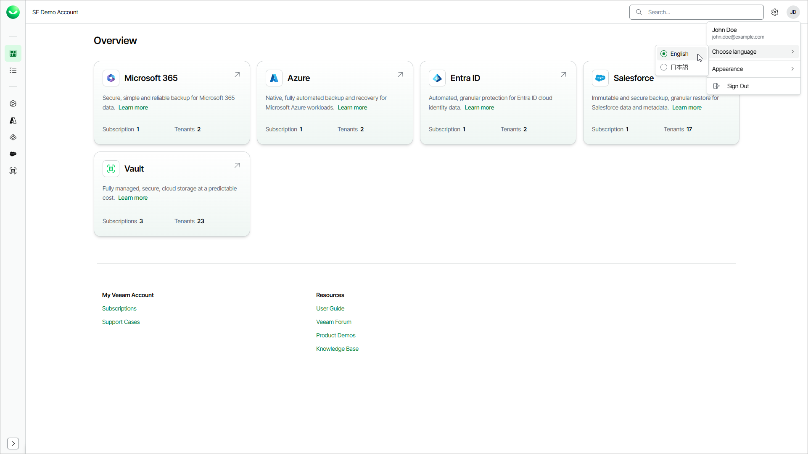
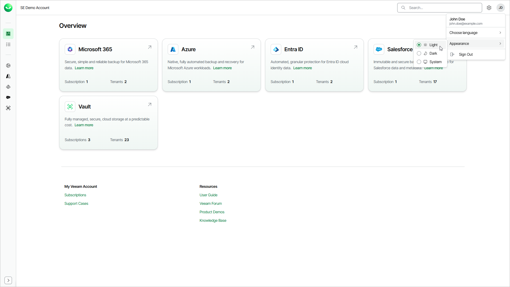

# Language and Appearance

You can change the Veeam Data Cloud language and appearance to suit your working environment.

Changing Language

The Veeam Data Cloud interface is available in English and Japanese languages. The first time you visit Veeam Data Cloud, the content is displayed in your browser language. If your browser language is not supported, the interface is displayed in English.

To select the Veeam Data Cloud interface language, do the following:

1. In the top-right corner of the Veeam Data Cloud page, click the user name initials.
2. In the menu, hover over Choose language and select English or 日本語.

Changing Appearance

You can change the appearance of the Veeam Data Cloud interface. You can choose from the light or dark themes, or set Veeam Data Cloud to follow your browser settings.

To change the Veeam Data Cloud interface appearance, do the following:

1. In the top-right corner of the Veeam Data Cloud page, click the user name initials.
2. In the menu, hover over Appearance and select one of the following options:

* Select Light to apply the light theme.
* Select Dark to apply the dark theme.
* Select System to set Veeam Data Cloud to follow your browser settings.

