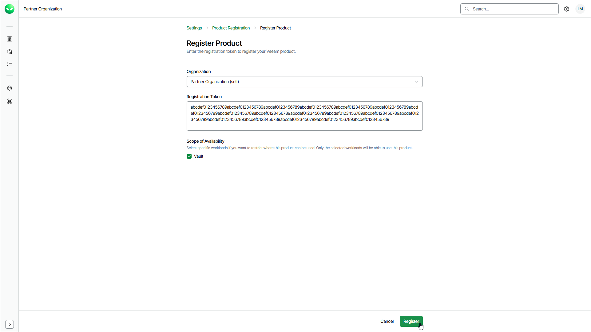

# Registering Products

To register an on-premises Veeam product, such as Veeam Backup & Replication, with Veeam Data Cloud, you must provide a registration token. You obtain this token from the product that you want to register.

To register a product, do the following:

1. Click the settings icon in the top-right corner.
2. Select Product Registration.
3. Click Register product.
4. From the Organization drop-down list, select the organization for which you want to register the product.
5. In the Registration Token field, paste the token that you obtained from the product.
6. [Optional] Under Scope of Availability, select the check boxes next to the workloads that can use the product. If you do not select any workload, the product is available to all workloads.
7. Click Register.

Page updated 2026-07-23
