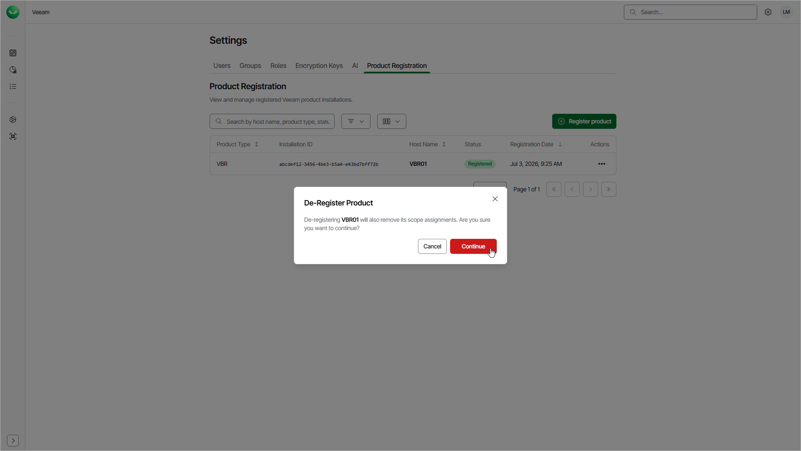

# Removing Products

To remove a registered product that you no longer need, you must de-register it in Veeam Data Cloud. When you de-register a product, Veeam Data Cloud removes its registration and scope assignments. After that, the product can no longer use Veeam Data Cloud services. To use Veeam Data Cloud services with the product later, you must register it again.

To remove a registered product, do the following:

1. In Veeam Data Cloud, go to Settings and open the Product Registration tab.
2. Click the settings icon in the top-right corner.
3. Select Product Registration.
4. On the Product Registration tab, in the Actions column of the product you want to edit, click the menu icon and select De-Register.
5. In the De-Register Product window, click Continue.

Page updated 2026-07-14
