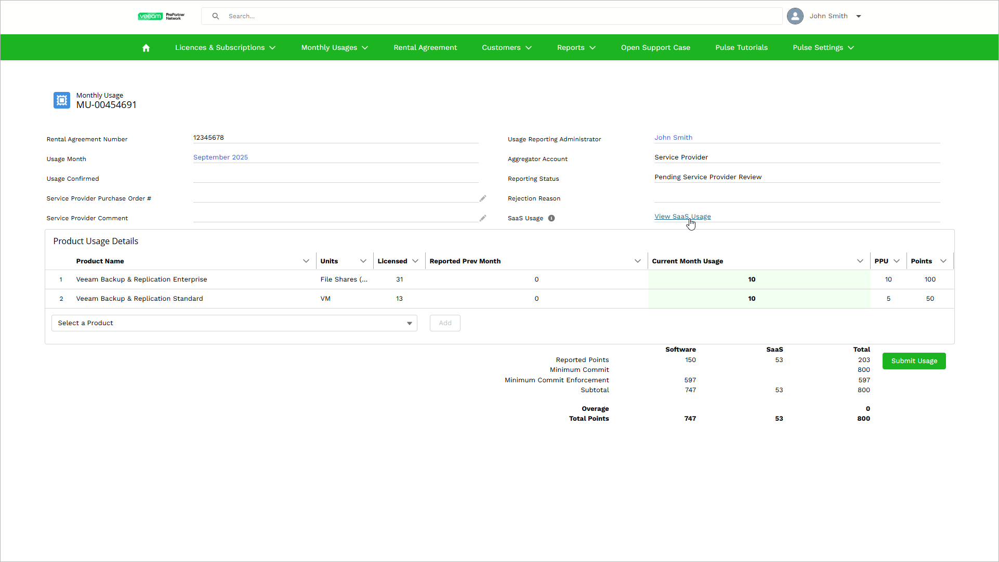
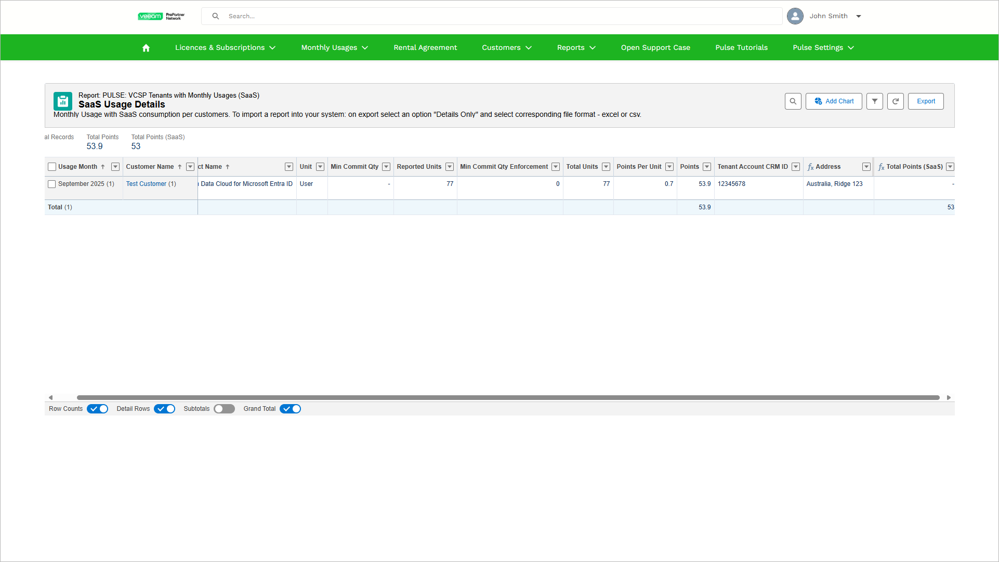
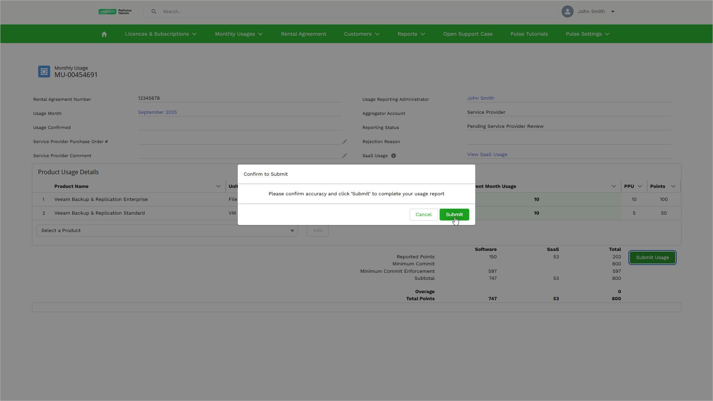

# Monthly Usage Reporting

To manage subscriptions, usage reports, and customer onboarding for Veeam Data Cloud workloads, you use VCSP Pulse — an end-to-end license and usage reporting management platform that offers a collaboration hub between Veeam, Aggregators, and VCSP partners. VCSP Pulse is a part of the ProPartner portal. Access to the platform is granted after a VCSP partner signs a rental agreement with a Veeam Aggregator.

For service providers who offer services through Veeam Data Cloud, VCSP Pulse facilitates initial onboarding to Veeam Data Cloud and monthly usage reporting. Information on Veeam Data Cloud usage is collected automatically and populated in the VCSP Pulse monthly usage report. The report contains the SaaS license usage and the number of consumed SaaS points.

You must review and submit SaaS usage data in VCSP Pulse every month. A monthly license usage report is generated on the first day of each month. It includes the number of monitored workloads for the past month. If you delay submitting the report for two consecutive months, your license management will be suspended.

Consider the following:

* If you do not use site reporting, any user with the Full Access role can submit a monthly usage report to the Aggregator.
* If you use site reporting:

* Each site must be submitted by the location usage administrator to the primary license administrator.
* A monthly usage report can be submitted to the Aggregator only by a primary license administrator of the rental agreement when they get all site usage reports from location usage administrators.

More information on how it works, getting started guide and how-to videos can be found at [the ProParter portal](https://propartner.veeam.com/vcsp-pulse).

|  |
| --- |
| Note |
| In case of issues related to the SaaS license usage, contact [Veeam Customer Support](https://www.veeam.com/support.html). |

To review and submit a monthly usage report, do the following:

1. Log in to VCSP Pulse. To do this, on [the ProPartner portal](https://propartner.veeam.com/), go to Manage My Business > VCSP Pulse and click Login to VCSP Pulse.
2. Select Monthly Usages > My Actions. VCSP Pulse will display a list of monthly usage reports that are pending review.
3. To view a monthly usage report, click the link in the Usage Month column.
4. To view monthly SaaS usage per customer, click View SaaS Usage. VCSP Pulse will open the SaaS Usage Details page in a new tab.

|  |
| --- |
| NOTE |
| If there is no SaaS usage for this monthly report, the View SaaS Usage link is hidden. |

1. On the SaaS Usage Details page, review the collected data. After you review the data, you can close this page.

1. On the Monthly Usage page, click Submit Usage.
2. To submit the report to your Veeam Aggregator, in the Confirm to Submit window, click Submit.

