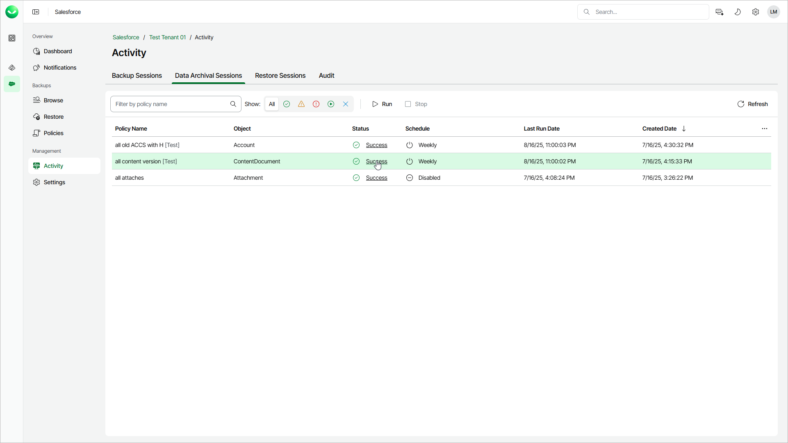
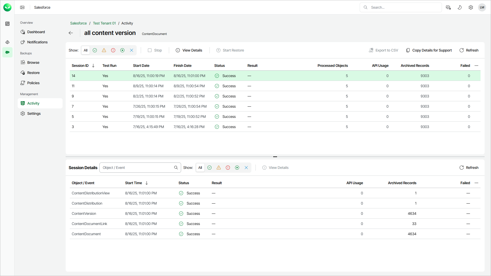

# Viewing Data Archival Sessions

For each performed archival operation, Veeam Data Cloud starts a new session according to the created archival polices, and stores the session details. You can check all running and completed archival sessions in the Activity section.

To view the list of archival policies, do the following:

1. On the Salesforce page, click Manage next to the tenant you want to work with.
2. Select Activity.
3. Select the Data Archival Sessions tab.

The Data Archival Sessions tab displays all archival policies and information about the last archival sessions. Each policy is described with the following set of properties:

* Policy Name — the name of the archival policy.
* Object — the name of the archived object.

* Status — the current status of the session.
* Schedule — the schedule of the archival policy.
* Start Date — the date and time when the session last run.
* Created Date — the date and time when the archival policy was created.

To open the list of sessions for a policy, click the status link of the policy.

The session list displays all archival sessions for a specific policy. To view the full list of session events, select a session from the session list.

The Session Details section displays information on all objects archived by the selected session. Each object is described with the following set of properties:

* Object / Event — the name of the archived object.

* Start Time — the date and time when Veeam Data Cloud started a new task to process the object.

* Status — the current status of the task.

* Result — an error or warning message.
* API Usage — the total number of API calls sent during the task.
* Archived Records — the total number of Salesforce records archived during the task.
* Failed — the total number of Salesforce records that Veeam Data Cloud failed to process.

If you want to provide [Veeam Customer Support](https://my.veeam.com/my-cases) with details of a specific archival session, select the session and click Copy Details for Support to copy the details to your clipboard. The copied details include Organization Id, Tenant Id, Archival Policy Id and Archival Session Id.

