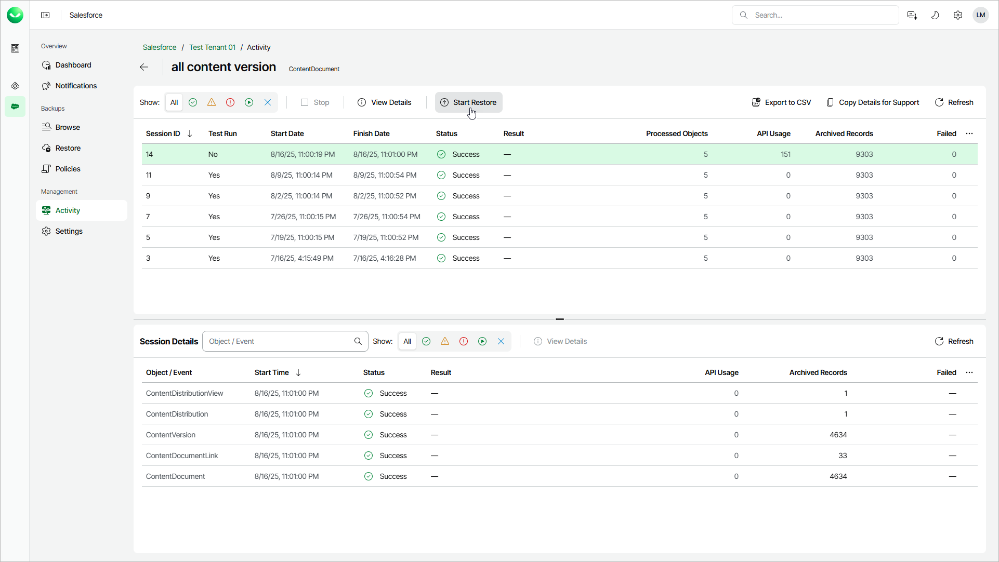

# Restoring Archived Data

When Veeam Data Cloud archives records and files, the archived data is removed from Salesforce. To restore archived data, you can select the necessary archival session from the archival policy session list and launch a restore wizard. Veeam Data Cloud will open the Restore Records or Restore Files wizard depending on the type of object archived by the session. In the restore wizard you can either restore all data archived by the session or select specific records or files.

You can also deploy Veeam Data Cloud Salesforce Extension that allows you to access and restore Salesforce archived data directly from the Salesforce console. The extension improves user experience and reduces administrative workload required to process data requests. For details, see [Configuring Salesforce Package Connection](sf_settings_connections_package.md).

To restore archived data, do the following:

1. On the Salesforce page, click the name of the tenant you want to manage.
2. Select Activity.
3. Select the Data Archival Sessions tab.
4. To view the list of archival sessions, click the status link of a policy.
5. On the page with the list of policy sessions, select a session.
6. Click Start Restore.
7. Complete the restore wizard as described in [Restoring Records](sf_restore_records.md) or [Restoring Files](sf_restore_files.md).

