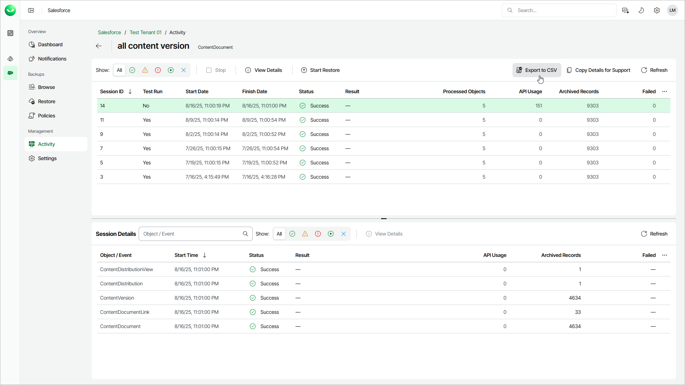

# Exporting Archived Data

You can export the list with all fields of the archived records as a CSV file.

|  |
| --- |
| Note |
| The feature is not available for archival policies launched in the test mode. |

To export archived data, do the following:

1. On the Salesforce page, click the name of the tenant you want to manage.
2. To view the list of backup sessions, select Activity on the left.
3. On the Data Archival Sessions tab, click the status link of a policy.
4. On the page with the list of policy sessions, click Export to CSV.

