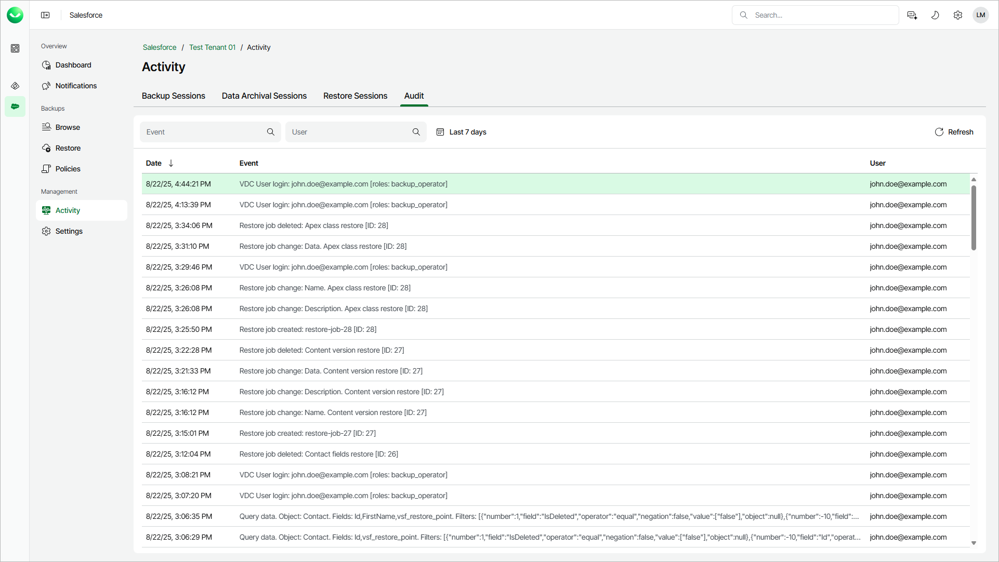

# Viewing Audit Trail

You can view a trail of all security-sensitive events such as connecting to Salesforce tenants, data backup and restore and so on.

|  |
| --- |
| Note |
| All audit log files older than 1 year are automatically removed. |

To view Veeam Data Cloud events, do the following:

1. On the Salesforce page, click the name of the tenant you want to manage.
2. Select Activity.
3. Select the Audit tab.

