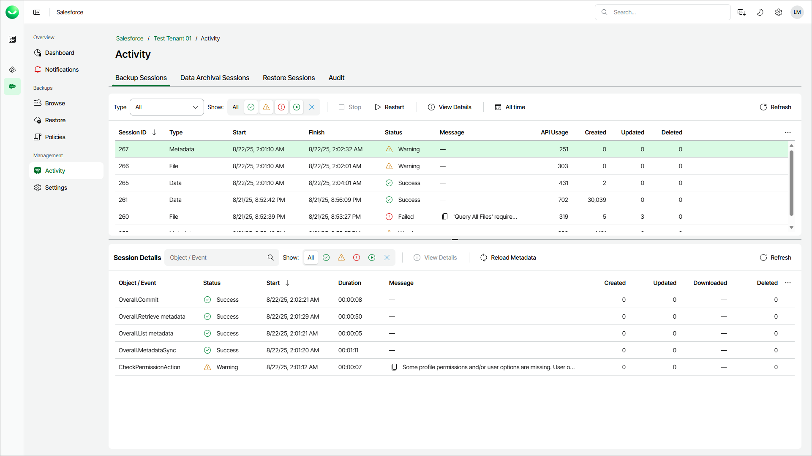

# Viewing Backup Sessions

For each data protection operation, Veeam Data Cloud starts a new backup session according to created backup policies. You can check all running and completed backup sessions in the Activity section.

To view the list of backup sessions, do the following:

1. On the Salesforce page, click the name of the tenant you want to manage.
2. Select Activity.
3. Select the Backup Sessions tab.

The Backup Sessions tab displays information on all sessions of the backup policy. Each session is described with the following set of properties:

* Session ID — the ID assigned to the session.
* Type — the type of the backup session. For details, see [Backup Session Types](sf_activity_backup_session_types.md).
* Start — the date and time when the session started.
* Finish — the date and time when the session finished.
* Status — the current status of the session.
* Message — an error or warning message.
* API Usage — the total number of API calls sent during the session.
* Created — the total number of new Salesforce records added to the backup scope during the session.
* Updated — the total number of Salesforce records updated in Salesforce during the session.
* Deleted — the total number of Salesforce records deleted from Salesforce during the session.

The Session Details section displays information on all objects included in a specific policy session. To view the full list of session events, select a session from the session list.

Each object is described with the following set of properties:

* Object / Event — the name of the backed-up object.
* Status — the current status of the task.
* Start — the date and time when Veeam Data Cloud started a new task to process the object.
* Finish — the date and time when Veeam Data Cloud completed the task.
* Duration — the duration of the task.
* Message — an error or warning message.

* Created — the total number of new Salesforce records added to the backup scope during the task.
* Updated — the total number of Salesforce records updated in Salesforce during the task.
* Downloaded — the total number of Salesforce files added to the Veeam Data Cloud file repository during the task.
* Deleted — the total number of records deleted from Salesforce during the task.

