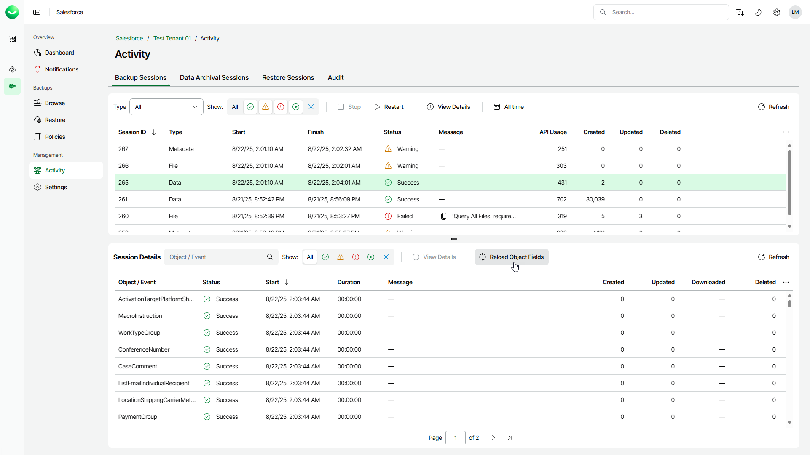

# Reloading Fields and Files

The functionality to reload fields and files compares the data in the backup with the data in Salesforce. This lets you identify the records and files that are missing in the backup and records that have different field values. The latter may be useful for the fields whose value change does not affect the last modified date of the record.

If some object fields or files included in a backup policy cannot be accessed using the Salesforce user that you have specified while adding the tenant, Veeam Data Cloud cannot back up these fields or files. If you want to back up these items, you can do either of the following and then reload object fields and files:

* Grant the required permissions to the account in the Salesforce console as described in [Salesforce documentation](https://help.salesforce.com/s/articleView?id=sf.permissions_about_users_access.htm&language=en_US&type=5). For the list of required permissions, refer to [Permissions](sf_permissions.md).
* Change the user that you use to connect to the Salesforce tenant. For details, see [Configuring Backup Service Connection](sf_settings_connections.md).

When reloading fields, Veeam Data Cloud will compare the data in the backup with the data currently stored in Salesforce and do the following:

* If Veeam Data Cloud identifies a record that is missing in the backup, the reload job will back up the record, creating a new restore point for the object. This includes any recently added and modified records as well as old records for that the Salesforce user didn’t have access to.
* If Veeam Data Cloud detects a field whose value in the latest version of the backed-up object is different from the value in Salesforce, the reload job will back up the data, creating a new restore point for the object. Otherwise, Veeam Data Cloud will skip the field from processing.
* If Veeam Data Cloud detects that the same file exists both in Salesforce and in the product database, the file will be skipped from processing. Otherwise, Veeam Data Cloud will back up the file.

|  |
| --- |
| Important |
| * If you want to reload object fields for objects that are currently being backed up, wait until the backup session completes. * Reloading fields of the FeedItem object type is not supported. * You cannot reload fields of the ContentFolderMember object separately. Veeam Data Cloud reloads those fields automatically when you reload  fields of the ContentFolder object. * You cannot reload fields of the ContentWorkspaceDoc object separately. Veeam Data Cloud reloads those fields automatically when you reload fields of the ContentWorkspace object. |

To reload object fields and files, do the following:

1. On the Salesforce page, click the name of the tenant you want to manage.
2. To view the list of backup sessions, select Activity on the left.
3. Choose the latest data session and click Reload Object Fields.
4. In the Reload Object Fields window, select items that you want to include in the backup policy and click Run.

