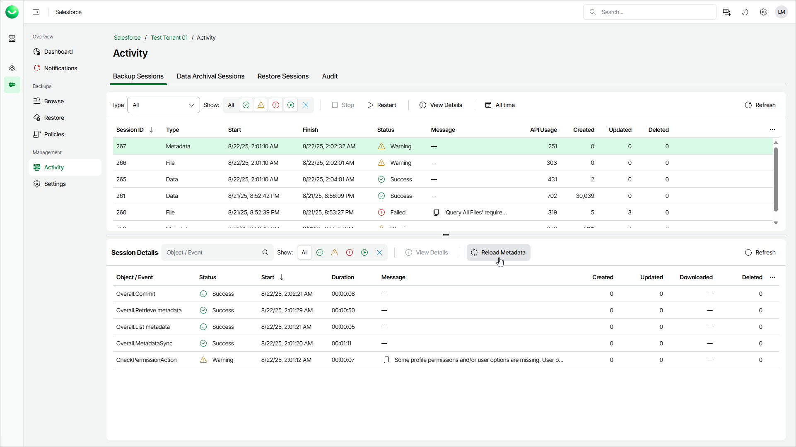

# Reloading Metadata

If you want to back up missing metadata items, you must reload the metadata. To reload metadata, Veeam Data Cloud starts a reload session and compare backed-up data in the product database with data currently stored in Salesforce. If Veeam Data Cloud detects that the same metadata item exists both in Salesforce and in the product database, the item is skipped from processing; otherwise, Veeam Data Cloud backs up the item.

To reload metadata, do the following:

1. On the Salesforce page, click the name of the tenant you want to manage.
2. To view the list of backup sessions, select Activity on the left.
3. Choose the latest metadata session and click Reload Metadata.

