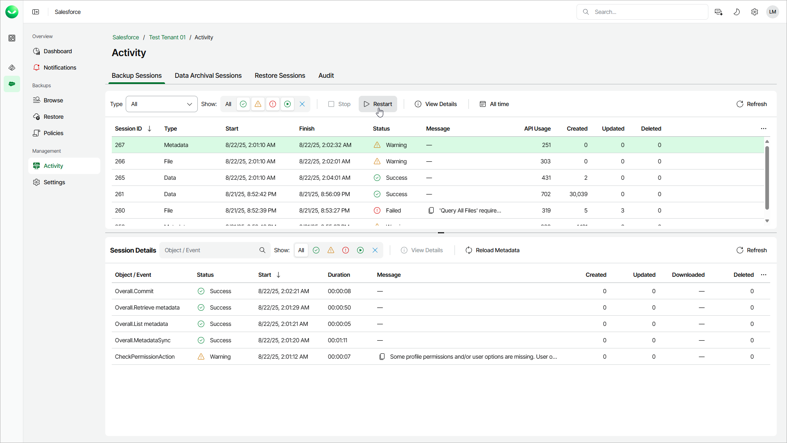

# Starting and Stopping Backup Sessions

If you do not want to start or stop the entire backup policy, you can do it for one of the policy sessions.

To start a backup session:

1. On the Salesforce page, click the name of the tenant you want to manage.
2. To view the list of backup sessions, select Activity on the left.
3. Choose the necessary session and click Restart.

To stop a backup session:

1. On the Salesforce page, click the name of the tenant you want to manage.
2. To view the list of backup sessions, select Activity on the left.
3. Choose the necessary session and click Stop.
4. Click one of the following in the Confirm Session Stop window:

* Click Hard Stop to immediately stop the backup session. In this case, Veeam Data Cloud will interrupt the currently running backup session, and the backup session will acquire the Aborted status.
* Click Graceful Stop to complete backup for Salesforce objects that are already being processed by the backup session. Veeam Data Cloud will stop the policy execution when backup of the processed objects is finished, and the backup session will acquire the Stopped status.

