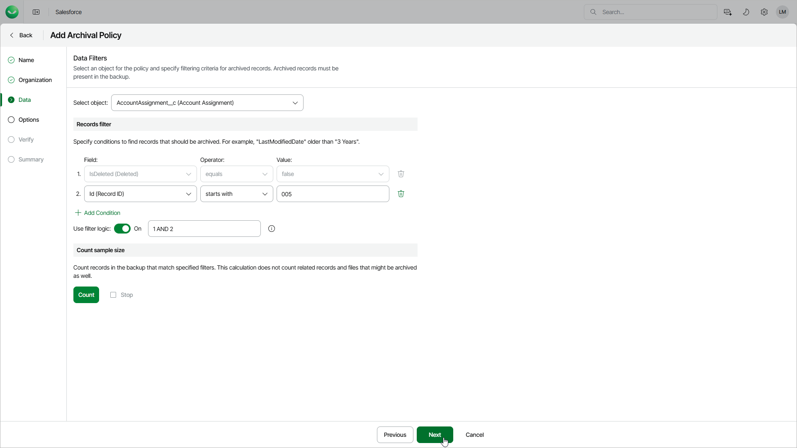

# Step 4. Choose Data to Archive

At the Data step of the wizard, do the following:

1. Select a Salesforce object whose records you want to archive. Note that one archival policy can archive records of one root object only. If you want to archive records of multiple root objects, create an archival policy for each object.

For a Salesforce object to be displayed in the list of available root objects, it must have a backup. If the list does not contain the necessary object, the object either does not have a backup or cannot be archived. The object may not have a backup for the following reasons:

* The object was excluded from the backup policy that protects the Salesforce tenant to which this object belongs.
* The Salesforce user whose permissions are used for backup operations does not have access to the object.
* Backup of the object is not supported in the current product version. For more information, see [Unsupported Salesforce Objects](sf_unsupported_objects.md).

1. To select records that you want to archive, configure specific conditions in the Records filter section.

Veeam Data Cloud provides a number of built-in conditional operators (such as contains, equals, starts with, is null and so on) that can be used to send requests to databases. When adding conditions, consider the following:

* If you want to search for records with null field values, use the is null operator. Using the equals operator in this case is not supported.
* If you want to search for a list of records, you can use the in operator and specify the IDs of the necessary records using a comma-separated list.
* If you want to search for a record but you do not have any information on this record except for the fact that it is linked to a specific object, you can use the lookup relationship field to filter all records linked to this object. To do that, specify the ID of the necessary object in the Value field. The Value field is case sensitive for the following operators: starts with, ends with, equals, in, not equal to, not in.

By default, filters are combined by the AND logical operator. That is, Veeam Data Cloud archives only those records that meet all the specified conditions. You can change this behavior by combining filters using different operators. To do that, set the Use filter logic toggle to On, and specify the filter logic expression using condition ordinal numbers, brackets and logical operators — for example, 1 AND (2 OR 3) AND NOT 4.

After you specify the filtering conditions, you can estimate the exact number of records that will be archived. To do that, click Count in the Count sample size section.

|  |
| --- |
| Note |
| * The time required to process a request depends on the operator you use — for example, processing a request with the equals operator will take less time than processing a request with the contains operator.  * If an object record that you want to archive contains encrypted fields, you will not be able to specify filters for these fields. * Veeam Data Cloud does not automatically archive the ContentDocument type of objects with the root object — you must create a dedicated policy and choose to archive the ContentDocument object type. However, if you select the QuoteDocument type of objects, Veeam Data Cloud will also archive the related ContentDocument objects. |

