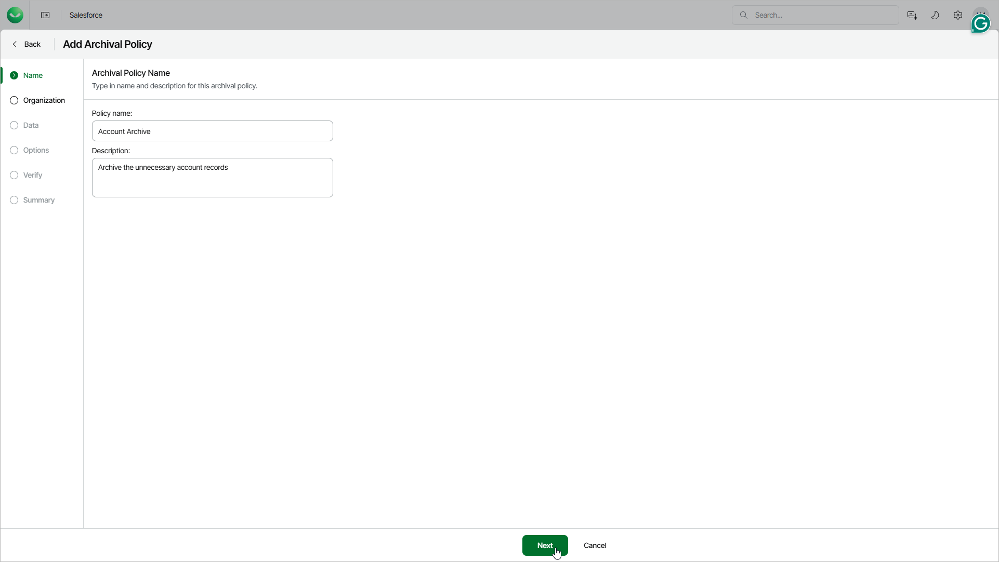

# Step 2. Specify Policy Name

At the Name step of the wizard, use the Policy name and Description fields to specify a name for the new archival policy and to provide a description for future reference. The maximum length of the policy name is 100 characters.

