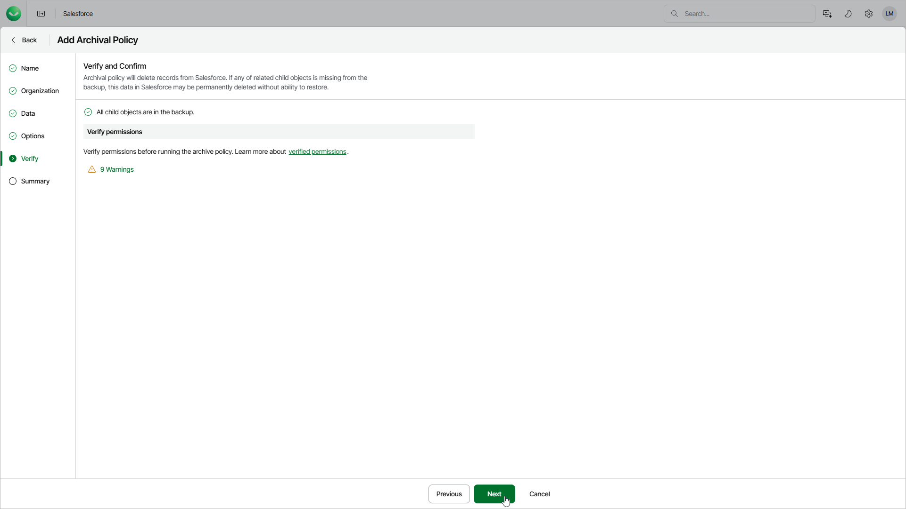

# Step 6. Verify Backup Consistency

At the Verify step of the wizard, Veeam Data Cloud will check whether all child objects related to the root object have backups. You must thoroughly review the list of these child objects and confirm whether they can be safely deleted from Salesforce. To do that, select the Confirm permanent deletion option.

Note that Veeam Data Cloud archives only those objects that are linked to the root object using master-detail relationships, required lookup field relationships, or optional lookup field relationships with the Delete this record also option enabled. For more information on object relationships, see [Salesforce documentation](https://help.salesforce.com/s/articleView?id=sf.overview_of_custom_object_relationships.htm&type=5).

|  |
| --- |
| Tip |
| If you want to keep backup of child objects which were identified as missing and be able to restore them later, [edit the data protection settings](sf_backup_policies_edit_backup_options.md#backup_exclude) of the backup policy that protects the Salesforce tenant to which the parent object belongs to include missing objects, [run the policy](sf_activity_backup_start_stop.md) to create an incremental backup — and then, modify the archival policy settings to check whether the necessary child objects now have backups. |

You must also verify whether the user that is used to perform the archival operation is assigned the permissions required to archive the selected Salesforce object. To do that, click the Not verified yet link and wait for the check to complete. If any of the permissions are missing, you must grant them in the Salesforce console manually as described in [Salesforce documentation](https://help.salesforce.com/s/articleView?id=sf.permissions_about_users_access.htm&language=en_US&type=5) or use another account.

