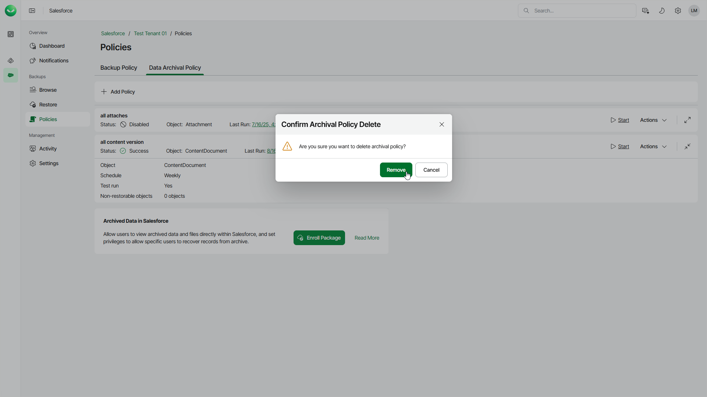

# Removing Archival Policies

Veeam Data Cloud allows you to permanently remove an archival policy if you no longer need it. When you delete an archival policy, the archived data and files will not be affected.

To delete an archival policy, do the following:

1. On the Salesforce page, click the name of the tenant you want to manage.
2. To view the policies created for this tenant, select Policies on the left.
3. On the Data Archival Policy tab, find the policy you need and select Actions > Delete.
4. In the Confirm Archival Policy Delete window, click Remove to confirm the deletion.

