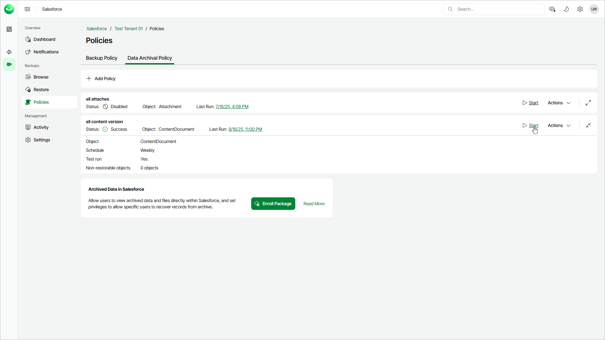

# Starting and Stopping Archival Policies

You can start an archival policy manually, for example, if you want to archive more records and do not want to modify the configured policy schedule. You can also stop a policy manually if processing is about to take too long, and you do not want the policy to affect the production environment during business hours.

To start an archival policy:

1. On the Salesforce page, click the name of the tenant you want to manage.
2. To view the policies created for this tenant, select Policies on the left.
3. On the Data Archival Policy tab, find the policy you need and click Start.

To stop an archival policy:

1. On the Salesforce page, click the name of the tenant you want to manage.
2. To view the policies created for this tenant, select Policies on the left.
3. On the Data Archival Policy tab, find the policy you need and click Stop.
4. In the Confirm Archival Session Stop window, click Yes.

