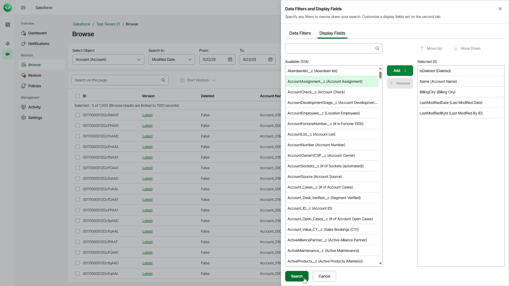

# Choosing Display Fields

To choose the field that you want to display, click the filter icon, select the Display Fields tab and select the necessary fields. Veeam Data Cloud saves your settings and will use them when you restore or browse backed-up data. To reset these settings, clear your browser cookies.

