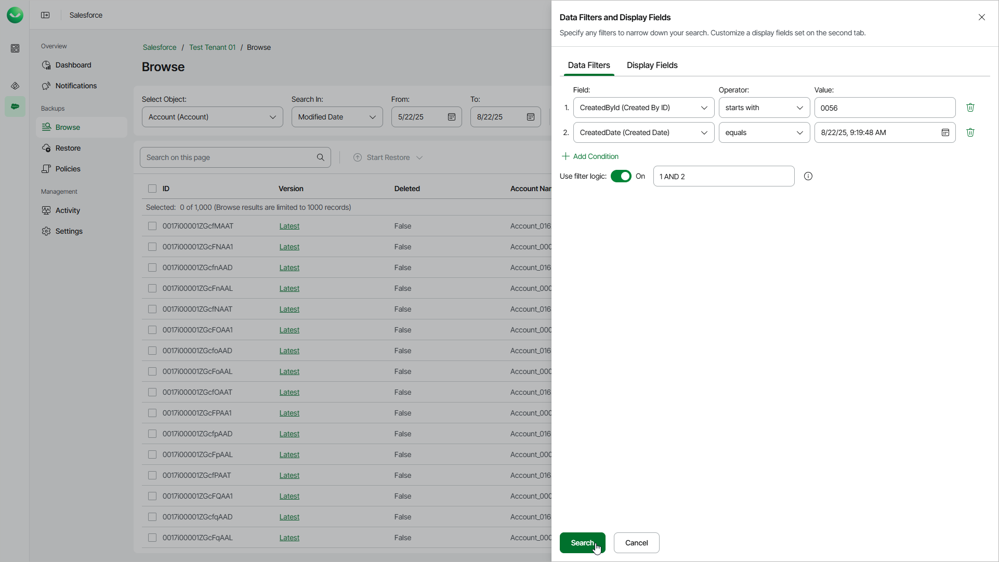

# Configuring Data Filters

When you browse Salesforce backups, Veeam Data Cloud displays the maximum number of 1000 records per page. If you want to apply specific search conditions and reduce the number of search results, or if you want to select specific Salesforce fields to be displayed in the search results, you can configure data filters.

To set the data filters, click the filter icon and add one or multiple filter conditions in the Data Filters and Display Fields window.

Veeam Data Cloud provides a number of built-in conditional operators (such as contains, equals, starts with, is null and so on). When adding conditions, consider the following:

* If you want to search for records with null field values, use the is null operator. Using the equals operator in this case is not supported.
* If you want to search for a list of records, you can use the in operator and specify the IDs of the necessary records using a comma-separated list.
* If you want to search for a record but you do not have any information on this record except for the fact that it is linked to a specific object, you can use the lookup relationship field to filter all records linked to this object. To do that, specify the ID of the necessary object in the Value field. The Value field is case sensitive for the following operators: starts with, ends with, equals, in, not equal to, not in.
* If you want to search for records that have been archived, use the vsf\_archived (Archive Restore Point) field.

By default, filters are combined by the AND logical operator. That is, a record is displayed in the search results only if all of the specified conditions are met. You can change this behavior by combining filters using different operators. To do that, set the Use filter logic toggle to On, and specify the filter logic expression using condition ordinal numbers, brackets and logical operators — for example, 1 AND (2 OR 3) AND NOT 4.

|  |
| --- |
| Note |
| * The time required to process a request depends on the operator you use — for example, processing a request with the equals operator will take less time than processing a request with the contains operator. * If a record contains encrypted fields, you will not be able to specify filters for these fields. |

