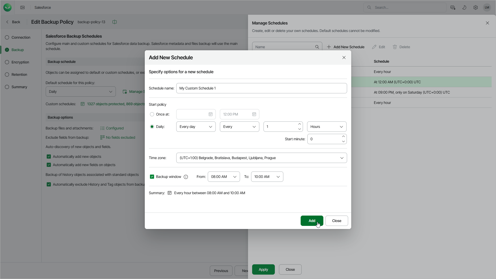

# Managing Schedules

You can create and edit and delete your own schedules if the option is available in your subscription. You can create multiple schedules; however, only the schedule that you set as the default for your backup policy and the custom schedules assigned to specific objects can start the backup policy.

|  |
| --- |
| Important |
| * You cannot delete a schedule that is used to back up any objects in the backup policy. If you want to delete such a schedule, you must first specify a schedule that will replace the deleted one.  * You cannot delete a schedule that is used for an archival policy. [Edit the archival policy settings](sf_archival_policies_create_options.md#schedule) to choose another schedule — and then try deleting the backup schedule again. |

To create a new backup schedule for the policy, do the following:

1. In the Backup schedule section, click Manage Schedules.
2. In the Manage Schedules window, click Add New Schedule.

1. In the Add New Schedule window, specify the schedule settings:

1. In the Schedule name field, specify a name for the schedule. The name must be unique within the Salesforce tenant.
2. In the Schedule type section, select the schedule type:

* To run a backup policy once, select One-time and specify the date and time when the backup policy must run.

Note that you cannot combine one-time schedules with recurring default and custom schedules for the same backup policy. If you select the One-time type of schedule as the default policy schedule, you must manually remove all recurring schedules configured for Salesforce objects, wait for the policy session to complete, and then re-configure recurring schedules for the policy.

* To run a backup policy periodically, select Recurring and specify the following settings:

From the Days drop-down list, select Every day to run the backup policy every day, or select Selected days to run it on specific days of the week. If you select Selected days, use the Selection drop-down list to choose the days of the week.

In the Run frequency section, select Repeat every to run the backup policy at a regular interval, and then specify the interval value, select the time unit (Hours or Minutes), and use the Starting at minute field to set the minute of an hour when the policy starts. Alternatively, select Once at a specific time to run the backup policy once a day at the time you specify.

For example, if you specify to run a backup policy every 9 hours starting at minute 30, Veeam Data Cloud will start the policy according to the following schedule (in the selected time zone): Mon 00:30, Mon 09:30, Mon 18:30, Tue 00:30, Tue 09:30, Tue 18:30, and so on.

|  |
| --- |
| Note |
| * If your Veeam Data Cloud for Salesforce subscription has more than 200 licensed users, the maximum backup frequency for a custom schedule is 15 minutes. * If your Veeam Data Cloud for Salesforce subscription has 200 or less licensed users, the maximum backup frequency for a custom schedule is 1 hour. |

1. From the Time zone drop-down list, select a UTC time offset. By default, the time zone of your browser is selected.
2. [Applies if you have selected the Recurring option] If you want the backup policy to run only during a specific period of time, select the Run window check box and specify the From and To time. The job starts only within the selected time window.
3. Review the settings, and then click Add.

