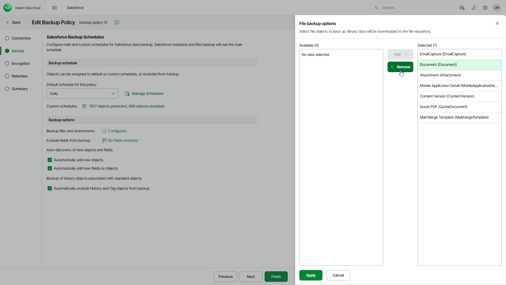

# Step 3b. Configure Additional Options

In the Additional backup options section of the Backup step of the wizard, you can modify additional data protection options.

1. To choose the types of files that you want to back up, click the link in the Backup files and attachments field and select the necessary file types in the File backup options window.

This option is available only if the Salesforce user that you have specified at the [Connection](sf_backup_policies_edit_connection.md) step is assigned the [Query All Files](sf_permissions.md) permission in Salesforce.

|  |
| --- |
| Note |
| If you choose to back up the ContentVersion type of objects, note that Veeam Data Cloud will also back up the following types of objects: ContentDocument, ContentVersion, ContentNote, ContentDocumentLink, FeedItem, and FeedAttachment. |

1. To exclude specific object fields from the backup policy, click the link in the Exclude fields from backup field and select object fields that you want to exclude.
2. To automatically back up new objects added to the Salesforce tenant, select the Automatically add new objects check box.
3. To automatically back up new object fields, select the Automatically add new fields on objects check box.
4. To include History and Tag objects associated with standard objects in the backup policy, clear the Automatically exclude History and Tag objects from backup check box. By default, this option is selected and History and Tag objects are excluded from backup.

