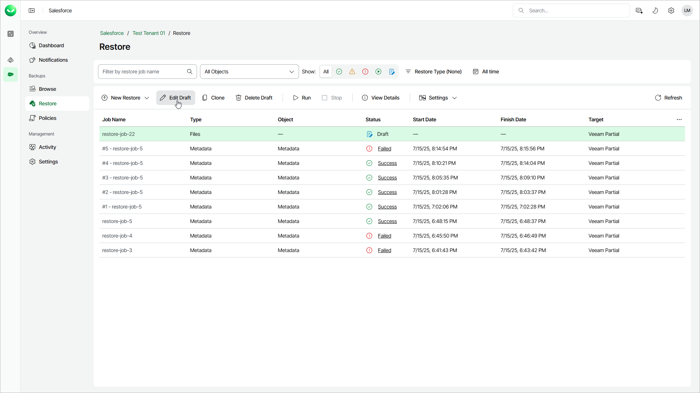

# Editing Restore Job Drafts

For each restore job that has the Draft status, you can edit settings configured while creating the job:

1. On the Salesforce page, click the name of the tenant you want to manage.
2. To view all restore jobs created for the tenant, select Restore on the left.
3. Select the necessary job draft.
4. Click Edit Draft.
5. To edit the draft, complete the restore job wizard as described in [Creating Restore Jobs](sf_creating_restore_jobs.md).

Note that changing the source and target tenants is not available for job drafts. To do that, create a new restore job.

