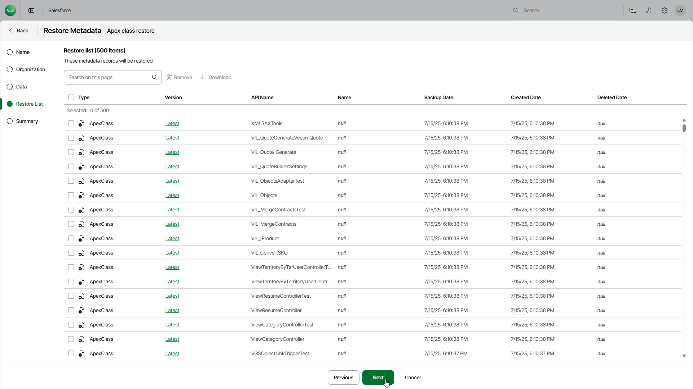

# Step 5. Review Restore List

At the Restore List step, review the list of items that you want to restore and proceed with the wizard. To remove some of the metadata items from the restore job, select the items and click Remove.

|  |
| --- |
| Tip |
| You can download up to 100 metadata files to the local machine. To do that, select the necessary objects and click Download. |

