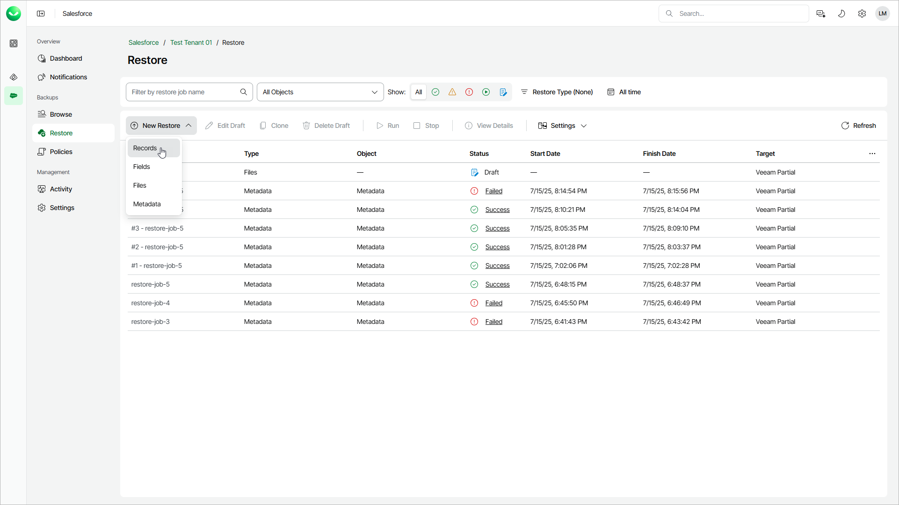

# Step 1. Launch Restore Records Wizard

To launch the Restore Records wizard:

1. On the Salesforce page, click the name of the tenant you want to manage.
2. To view all restore jobs created for the tenant, select Restore on the left.
3. Select New Restore > Records.

