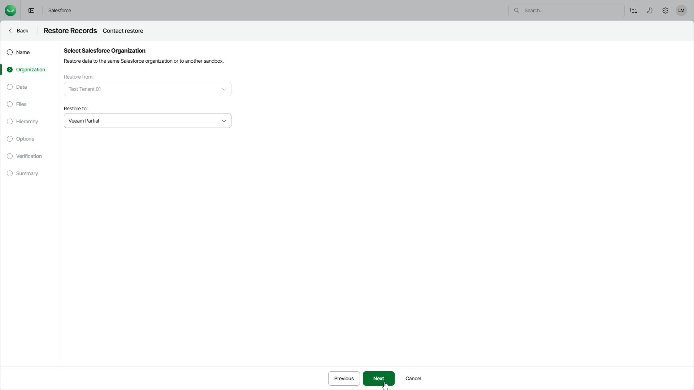

# Step 3. Select Target Tenant

At the Organization step of the wizard, you can choose to restore records to the same Salesforce tenant or its sandbox copy (for example, you may want to seed a sandbox with backed-up data of another tenant).

To select another target tenant, use the Restore to drop-down list. The list contains only Salesforce tenants that are compatible with the source tenant.

|  |
| --- |
| Important |
| * The source and target Salesforce tenants must be located in the same region. * When you restore an object record to another tenant, make sure that the metadata of the object that you want to restore matches the object metadata in the target tenant. If metadata is missing or does not match, you must first create a [metadata restore job](sf_restore_metadata.md).  * When you restore an object record that contains encrypted fields to the same tenant, Veeam Data Cloud decrypts and restores the fields. If you want to restore such a record from a production to a sandbox tenant, provide [override values for these fields](sf_restore_records_options.md); otherwise, the fields will not be restored. |

