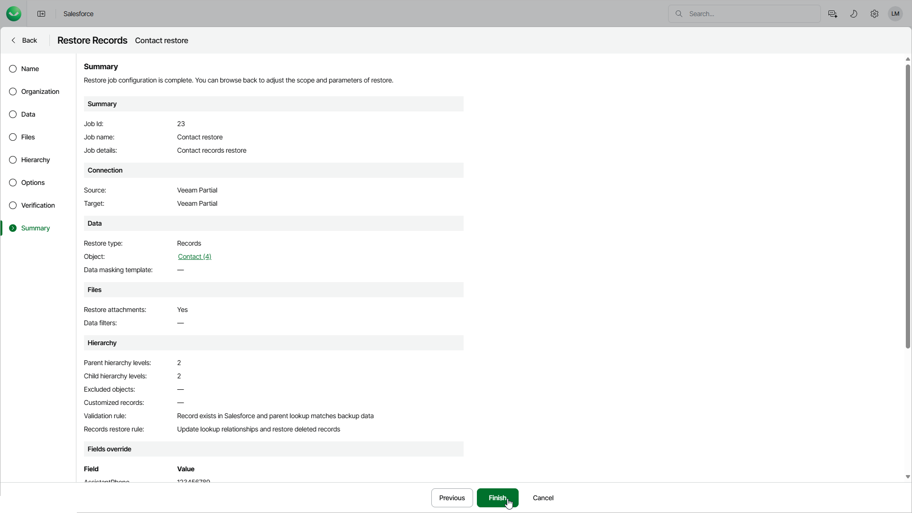

# Step 9. Finish Working with Wizard

At the Summary step of the wizard, review configured settings and click Finish.

If you want Veeam Data Cloud to start restore automatically after you complete the wizard, select the Start the session after clicking the Finish button check box. Otherwise, a job draft will be created, and you will have to manually run the session as described in section [Starting and Stopping Restore Jobs](sf_restore_start_stop.md).

|  |
| --- |
| Tip |
| To view all objects added to the restore job, click the link in the Object field. |

