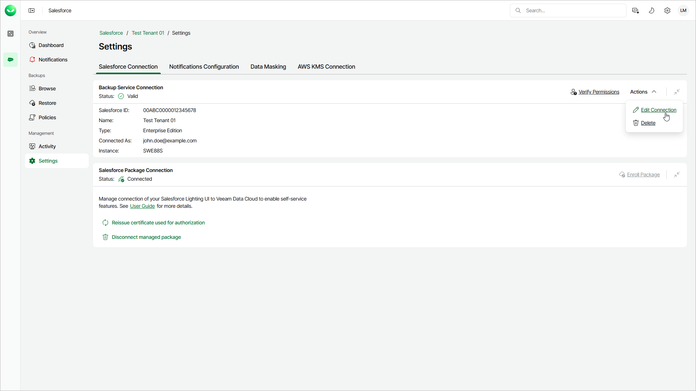
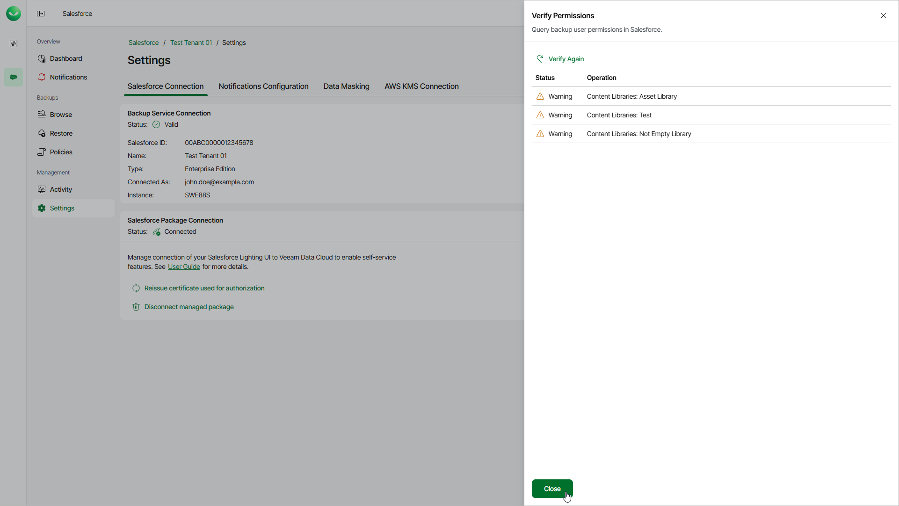

# Configuring Backup Service Connection

You may need to edit a backup service connection when you want to change the user that Veeam Data Cloud uses to connect to your Salesforce tenant. You can also verify whether the account has sufficient permission to perform backup operations.

Editing Backup Service Connection

To edit the connection, do the following:

1. On the Salesforce page, click the name of the tenant you want to manage.
2. Select Settings.
3. Make sure that the Salesforce Connection tab is selected.
4. Select Actions > Edit Connection. You will be redirected to the Salesforce authentication webpage.
5. On the Salesforce authentication webpage, enter credentials of a Salesforce user and click Log in. After that, you will be redirected back.

The specified user must be assigned permissions required for Veeam Data Cloud to perform backup and restore operations. For information, see [Permissions](sf_permissions.md).

|  |
| --- |
| Note |
| If Veeam Data Cloud displays the OAUTH\_APP\_ACCESS\_DENIED error when you change the Salesforce user, the VDC Salesforce Backup connected app is not authorized for the new user. To resolve the issue, contact your Salesforce administrator and request that they update the user profile to allow access to the connected app. |

Verifying Permissions

You can verify whether permissions assigned to the specified user are enough to perform backup operations.

To verify permissions, do the following:

1. Click Salesforce on the left.
2. Click Manage next to the tenant you want to work with.
3. Select Settings.
4. Make sure that the Salesforce Connection tab is selected.
5. Click Verify Permissions and wait for the check to complete. If any of the permissions are missing, you must grant them in the Salesforce console manually as described in [Salesforce Documentation](https://help.salesforce.com/s/articleView?id=sf.permissions_about_users_access.htm&language=en_US&type=5).

