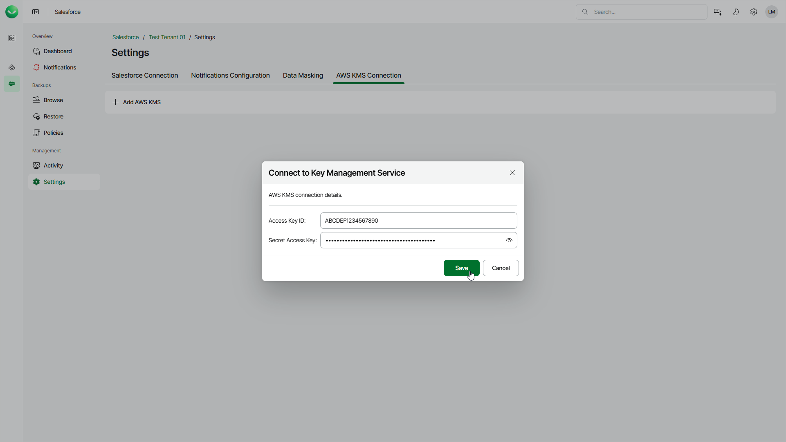

# Adding AWS KMS Connections

To encrypt backed-up data using an AWS KMS master key, you must first add an AWS KMS connection. The added KMS connection will be available for all tenants in your Veeam Data Cloud organization that use the same Azure region.

To add a connection to the AWS Key Management service, do the following:

1. On the Salesforce page, click the name of the tenant you want to manage.
2. Select Settings.
3. Select the AWS KMS Connection tab.
4. In the Connect to Key Management Service window, specify an access key pair. Veeam Data Cloud will use it to authenticate requests to the AWS Key Management service.
5. Click Save.

