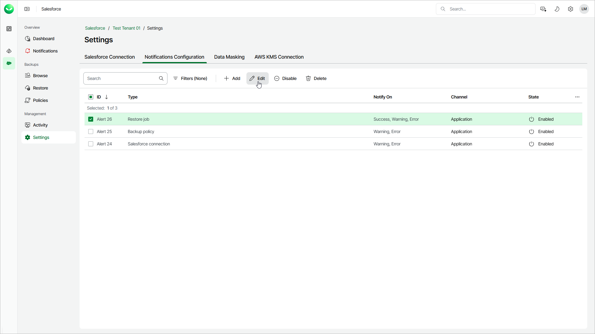

# Editing Notifications

To edit a notification, use the Edit Notification wizard:

1. On the Salesforce page, click the name of the tenant you want to manage.
2. Select Settings.
3. Select the Notifications Configuration tab.
4. In the list of notifications, select the notification that you want to edit.
5. Click Edit.
6. To complete the Edit Notification wizard, follow the instructions described in the [Adding Notifications](sf_settings_notifications_add.md) section.

