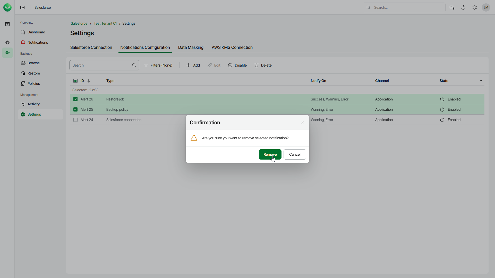

# Removing Notifications

You can remove a notification if you no longer need it.

To remove a notification, do the following:

1. On the Salesforce page, click the name of the tenant you want to manage.
2. Select Settings.
3. Select the Notifications Configuration tab.
4. In the list of notification, select the notifications that you want to delete.
5. Click Delete.
6. In the Confirmation window, click Remove to confirm the deletion.

