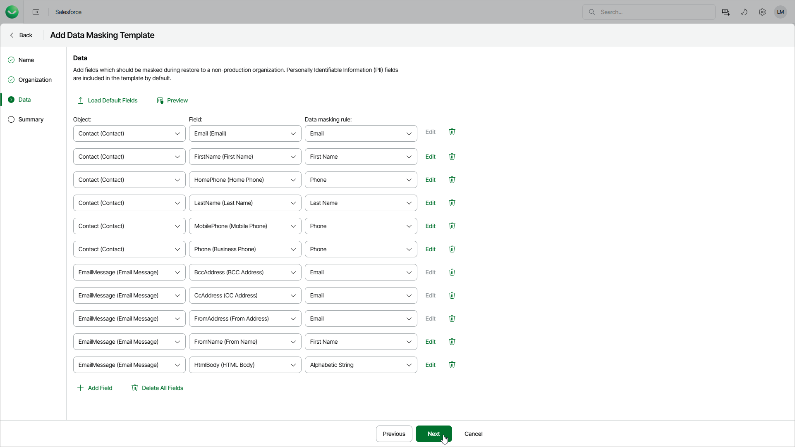

# Step 4. Specify Masked Data

At the Data step of the wizard, modify the default template to configure data masking rules for objects and fields.

After you modify the template, you can generate an example output to check whether the masking settings are configured properly. To do this, click Preview.

