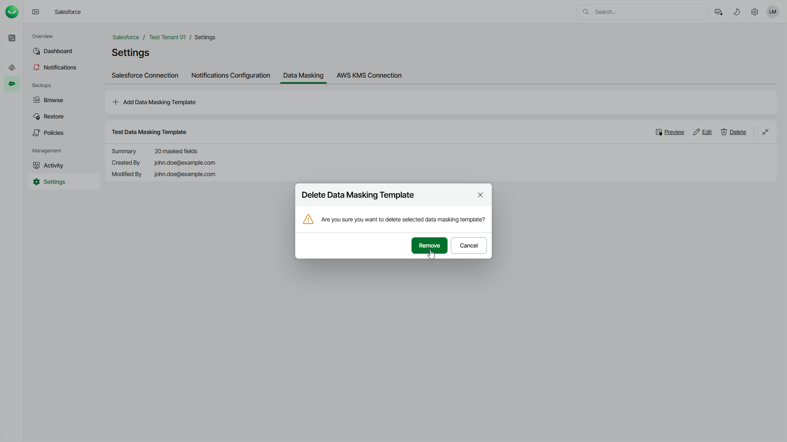

# Removing Data Masking Templates

Veeam Data Cloud allows you to permanently remove a data masking template if you no longer need it.

To remove a template, do the following:

1. On the Salesforce page, click the name of the tenant you want to manage.
2. Select Settings.
3. Select the Data Masking tab.
4. Click Delete next to the template you want to remove.
5. Click Remove to confirm the deletion.

