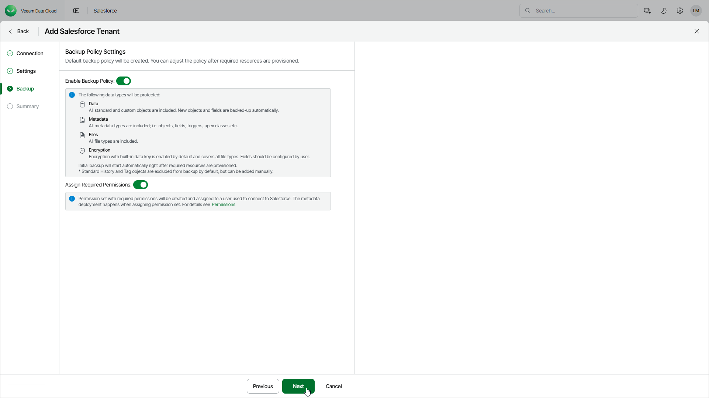

# Step 4. Configure Backup Policy

At the Backup step of the wizard, select Enable backup policy to allow Veeam Data Cloud to create the default backup policy and start the initial backup after the tenant is added. If you do not enable the backup policy now, Veeam Data Cloud will create the policy and you can edit and enable it later. For details, see [Editing Backup Policies](sf_backup_policies_edit.md) and [Enabling and Disabling Backup Policies](sf_backup_policies_disable_enable.md).

The default backup policy is created with the following settings:

| Policy Setting | Default Value |
| --- | --- |
| Salesforce API limits | 60% |
| Default policy schedule | Daily |
| Included tenant objects | All except standard History and Tag objects. By default, these objects are excluded from backup, but you can add them manually. For details, see [Configure Additional Options](sf_backup_policies_edit_backup_options.md). |
| Included file types | All  Note: If the Salesforce user that you use to connect to your Salesforce tenant doesn't have the Query All Files permission assigned, file backup will be disabled. To enable file backup, grant the permission in the Salesforce console as described in [Salesforce documentation](https://help.salesforce.com/s/articleView?id=sf.permissions_about_users_access.htm&language=en_US&type=5) and then enable file backup in the backup policy. For details, see [Configure Additional Options](sf_backup_policies_edit_backup_options.md). |
| Automatically add new objects | Enabled |
| Automatically add new fields | Enabled |
| Encryption | Enabled with built-in encryption key. All file types are selected for encryption. |
| Retention for records and file versions | 1 year |
| Retention for deleted records and files | 1 year (not configurable) |

To back up and restore Salesforce data, the user that Veeam Data Cloud uses to connect to the Salesforce tenant must be assigned a set of permissions. To allow Veeam Data Cloud to automatically assign the permissions, select Assign Required Permissions. For more information on the required permissions, see [Permissions](sf_permissions.md).

