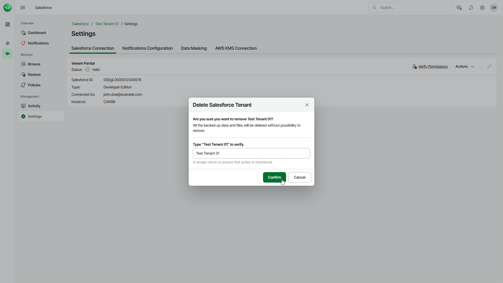

# Removing Salesforce Tenants

You can permanently remove a Salesforce tenant if you no longer need it. You can remove all tenant types — production, trial, sandbox and developer. This feature is available only for users assigned the Salesforce:Administrator or Salesforce:BackupOperator role. Service providers can remove a Salesforce tenant only if the customer has enabled the Delegated management by partner option in their Veeam Data Cloud organization.

When you remove a production tenant, Veeam Data Cloud will handle your backed-up data according to the Veeam Data Cloud service agreement. For details, see [this Veeam webpage](https://www.veeam.com/legal/veeam-data-cloud-service-agreement.html). When you remove a trial, sandbox or developer tenant, the backed-up data, metadata and files will be permanently deleted from Veeam Data Cloud and unavailable for restore.

To remove a tenant, do the following:

1. On the Salesforce page, click the name of the tenant you want to manage.
2. Select Settings on the left.
3. Make sure that the Salesforce Connection tab is selected.
4. Select Actions > Delete.
5. In the Delete Salesforce Tenant window, type the required text to verify the deletion.
6. Click Confirm.

