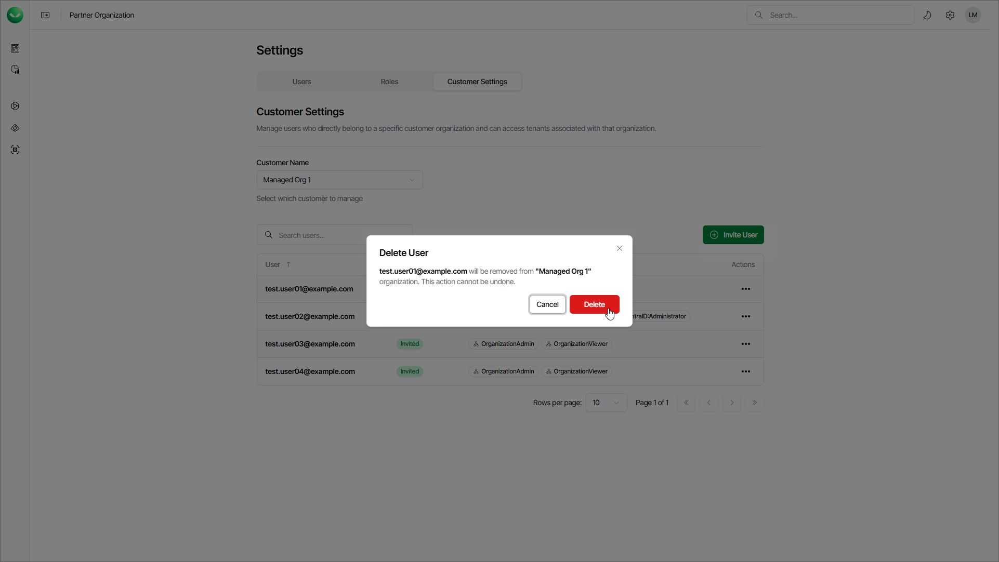

# Deleting Customer Users

You can delete a user account of your customer if your customer no longer needs it.

To delete a customer user, do the following:

1. Click the settings icon in the top-right corner.
2. Select Customer Settings.
3. From the Customer Name drop-down list, select a customer organization from which you want to delete a user.
4. In the list of users, click the menu in the Actions field of the user that you want to delete and select Delete.
5. In the Delete User window, click Delete.

