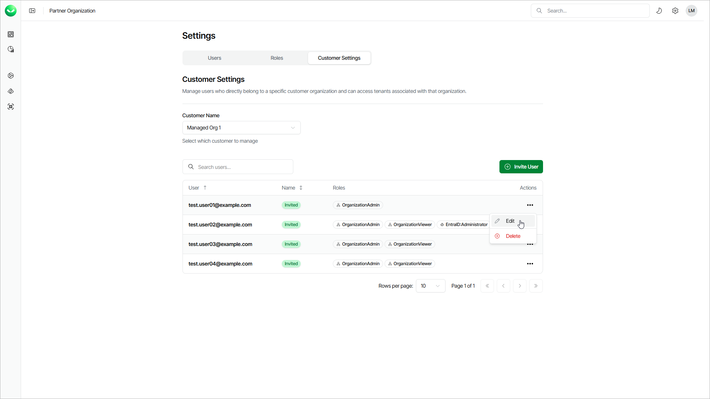

# Editing Customer Users

You may need to edit a user of the customer organization to adjust assigned roles and role scopes.

|  |
| --- |
| Note |
| Each Veeam Data Cloud user must have at least one of the organization-level roles assigned: OrganizationAdmin or OrganizationViewer. For details, see [Roles](users_roles.md). |

To edit a customer user, do the following:

1. Click the settings icon in the top-right corner.
2. Select Customer Settings.
3. From the Customer Name drop-down list, select a customer organization in which you want to edit a user.
4. To complete the editing, follow the instructions described in the [Editing Users](users_edit.md) section.

