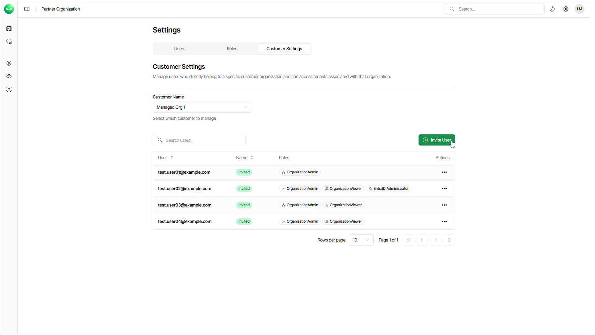

# Adding Customer Users

Veeam Data Cloud allows you to add users, assign roles to them, and specify a role scope that defines which tenants the user can access. When you add a user to a Veeam Data Cloud organization of your customer, the user will receive an email with an invitation link.

User roles define the operations that the user can perform, including backup, restore and user management. You can assign a role with access to your entire Veeam Data Cloud organization or a specific workload, such as Microsoft Entra ID, Salesforce or Microsoft 365. Role scopes define the tenants that the user can access, which can be helpful in larger organizations with multiple tenants where users are assigned to manage specific tenants.

|  |
| --- |
| Note |
| If you have users with scoped roles, manually update the role scopes after adding a new tenant to ensure the necessary users have access to the new tenant. |

To add a user to the customer Veeam Data Cloud organization, do the following:

1. Click the settings icon in the top-right corner.
2. Select Customer Settings.
3. From the Customer Name drop-down list, select a customer to which you want to invite a user.
4. To complete the invitation, follow the instructions described in the [Adding Users](users_add.md) section.

