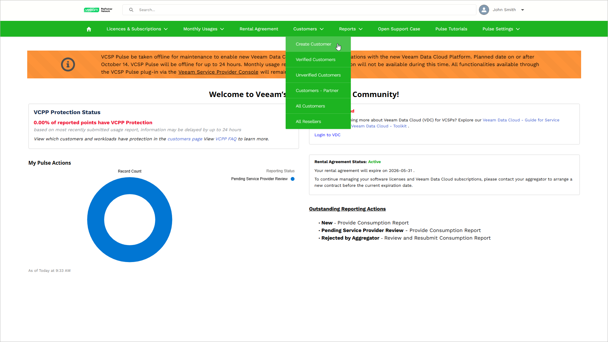
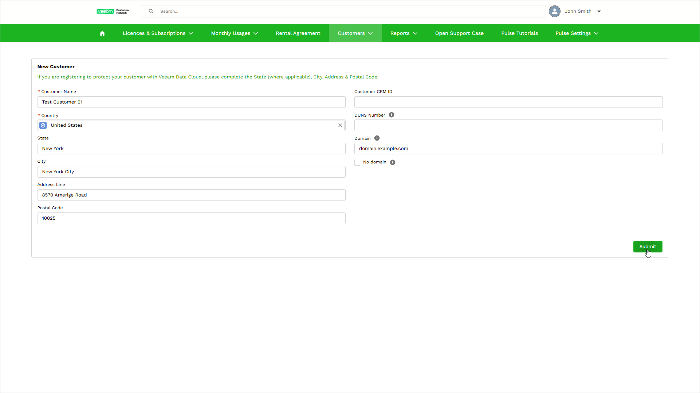

# Creating Customers

To offer backup as a service using Veeam Data Cloud, the service provider must create customers in VCSP Pulse. Before you start creating Veeam Data Cloud customers in VCSP Pulse, make sure that the account of the ProPartner employee you use to log in to VCSP Pulse has the Full Access role assigned. For more information on how to assign this role, see [Assigning Roles in ProPartner Portal](sp_customers_create_assign_roles.md).

|  |
| --- |
| Tip |
| You can also create a customer for your own organization if you want Veeam Data Cloud to back up your data. |

To create a customer, do the following:

1. Log in to VCSP Pulse. To do this, on [the ProPartner portal](https://propartner.veeam.com/), go to Manage My Business > VCSP Pulse and click Login to VCSP Pulse.
2. In VCSP Pulse, click Customers > Create Customer.

1. On the New End Customer page, enter the customer details. The required fields are marked with asterisk (\*).

If you plan to provide the customer access to Veeam Data Cloud, in the Domain field, specify a valid domain. This domain must be managed by the customer organization and cannot be a public email service provider domain. Veeam Data Cloud sends invitations only to email addresses within the specified domain.

1. Click Submit.

VCSP Pulse will create an account for the customer. This process may take up to 10 minutes. Once the customer is created in VCSP Pulse, request a subscription for the customer and complete the onboarding process in Veeam Data Cloud. For details, see [Requesting Subscriptions](sp_subscriptions_request.md) and [Onboarding Customers](sp_customers_onboard.md).

