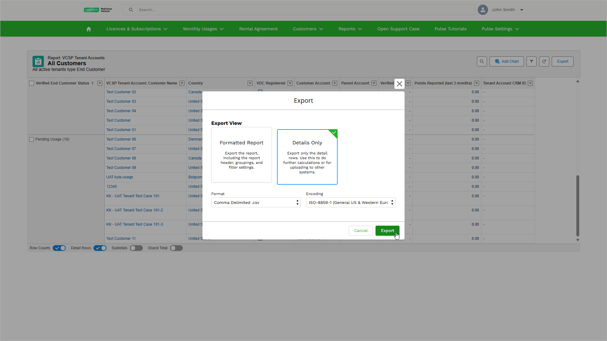

# Exporting Customers Data

VCSP Pulse allows you to export customer data to an XLSX, XLS and CSV file for further analysis and reporting.

To export the list of customers, do the following:

1. Log in to VCSP Pulse. To do this, on [the ProPartner portal](https://propartner.veeam.com/), go to Manage My Business > VCSP Pulse and click Login to VCSP Pulse.
2. In VCSP Pulse, click Customers > All Customers.
3. Click Export.
4. In the Export window, select a view that you want to export:

* Select Formatted Report to receive an XLSX file that includes a filtered view with a header and item grouping.
* Select Details Only to receive an XLSX, XLS or CSV file that includes only the data in rows. Then, use the Format and Encoding fields to specify a format and encoding of the exported file.

1. Click Export.

