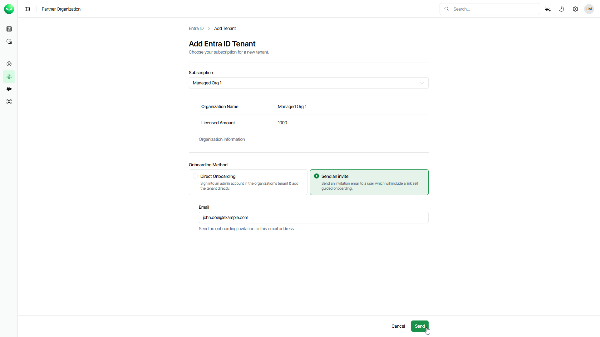

# Customer-Managed Onboarding

You can invite customers to complete the onboarding process themselves. Customers will receive an email with an invitation link that allows them to sign up to Veeam Data Cloud and add a new tenant to the Veeam Data Cloud workload they were invited to. The customers that you want to invite must have an assigned subscription. For details, see [Requesting Subscriptions](sp_subscriptions_request.md).

After you invite a customer to add the first tenant to their Veeam Data Cloud organization, Veeam Data Cloud will automatically disable the Delegated management by partner option in the customer Veeam Data Cloud organization. If this option is disabled, you cannot manage Veeam Data Cloud tenants and users in the customer organization. However, you can still add tenants and invite the customer to add tenants to the Veeam Data Cloud organization of the customer. Customers can also enable the Delegated management by partner option again. For details, see the [Configuring Partner Access](https://helpcenter.veeam.com/docs/vdc/userguide/sp_partner_access.html) section of the Veeam Data Cloud User Guide.

You can resend, edit and cancel the invitation you sent to your customer. For details, see [Managing Invitations](sp_customers_invite_manage.md).

To invite a customer for self-service onboarding, do the following steps:

1. Log in to Veeam Data Cloud. For details, see [Accessing Veeam Data Cloud](accessing_vdc.md).
2. To open the list of tenants for a specific Veeam Data Cloud workload, click a workload name on the left.
3. Click Add Tenant.
4. On the Add Tenant page, from the Subscription drop-down list, select a subscription of the customer you want to invite.
5. Select Send an invite.
6. In the Email field, specify an email to which you want to send the invitation.
7. Click Send.
8. In the Send Invitation window, click Continue to confirm sending the invitation email.

