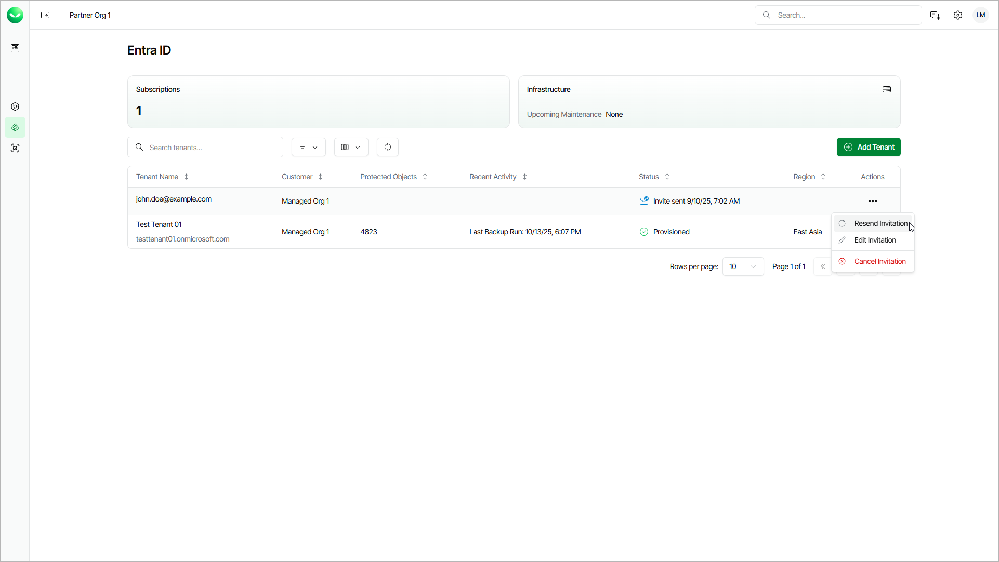

# Managing Invitations

If you have invited customers to complete the onboarding process themselves and the customer has not accepted the invitation yet, you can resend, edit or cancel it.

Resending Invitations

To resend an invitation, do the following steps:

1. Log in to Veeam Data Cloud. For details, see [Accessing Veeam Data Cloud](accessing_vdc.md).
2. To open the list of tenants for a specific Veeam Data Cloud workload, click a workload name on the left.
3. In the tenant list, click the menu in the Actions column of the tenant whose invitation you want to resend and select Resend Invitation.

Editing Invitations

To edit an invitation, do the following steps:

1. Log in to Veeam Data Cloud. For details, see [Accessing Veeam Data Cloud](accessing_vdc.md).
2. To open the list of tenants for a specific Veeam Data Cloud workload, click a workload name on the left.
3. In the tenant list, click the menu in the Actions column of the tenant whose invitation you want to edit and select Edit Invitation.
4. In the Edit Invite window, specify a new email address to which you want to send the invitation.
5. Click Save. Veeam Data Cloud will cancel the previous invitation and send a new one to the specified email address.

Canceling Invitations

To cancel an invitation, do the following steps:

1. Log in to Veeam Data Cloud. For details, see [Accessing Veeam Data Cloud](accessing_vdc.md).
2. To open the list of tenants for a specific Veeam Data Cloud workload, click a workload name on the left.
3. In the tenant list, click the menu in the Actions column of the tenant whose invitation you want to cancel and select Cancel Invitation.
4. In the Cancel Invite window, click Continue to confirm the cancellation of the invitation.

